<!-- GENERATED FILE — do not hand-edit.
     Regenerate with `devx graph`; `devx graph --check` fails on drift.
     Source of truth is the backlog rows + spec frontmatter this renders. -->

# Story graph

82 specs across 5 groups — 4 blocked · 27 done · 13 in-progress · 38 ready; 114 edges.

## Legend

| Glyph | Meaning |
|---|---|
| `A --> B` | A is **blocked by** B — B must land first |
| `A -.-> B` | **lineage** — A spawned, or was superseded by, B |
| `A --- \|par\| B` | **parallel-safe** — A and B may run at once |
| subgraph | one workstream or epic; a fully-settled one collapses to a summary node |
| node fill | `ready` blue · `in-progress` amber · `blocked` red · `done` green · `deleted`/`superseded` grey |
| `(INTERVIEW Q＃n)` / `(MANUAL Mx)` | the item is gated on a human decision or action |

## Board

```mermaid
flowchart TD
  subgraph sg_browser_qa_agent["browser-qa-agent (workstream)"]
    41ee13["41ee13 Browser Qa Agent"]
    bqa101["bqa101 Config truth — qa flip to installed tools…"]
    bqa102["bqa102 E2E revival — one-command green with life…"]
    bqa103["bqa103 Upstream story-derived QA — template, emi…"]
    bqa104["bqa104 Upstream attended layer — devx-test skill…"]
    bqa105["bqa105 Palateful adoption — install, qa flip, br…"]
    bqa106["bqa106 First attended pass — walkthrough emissio…"]
    bqa107["bqa107 Persona-seeded passes — --persona flag +…"]
    bqaret["bqaret Retro + LEARN.md updates (interim retro d…"]
    fltup1["fltup1 Upgrade local Flutter toolchain to the re…"]
  end
  subgraph sg_rotation_self_heal["rotation-self-heal (workstream)"]
    3a50ae["3a50ae E-7 follow-up: confirm the scheduled depl…"]
    462355["462355 Rotation Self Heal"]
    absal1["absal1 U3 — alert when an expected signal goes s…"]
    af8309["af8309 Continue 7c5cf2: rsh108 follow-up: run th…"]
    alrt1["alrt1 G1: SNS alert topic `palateful-prod-alert…"]
    authrep1["authrep1 N1 — the auth path reports its failures (…"]
    clidet1["clidet1 Client-side detection and alerting — what…"]
    dfrcp1["dfrcp1 G3 + G11 — give deploy-freshness a recipi…"]
    fxfuse["fxfuse Drain the 29-file hardcoded-fixture-date…"]
    obsgap1["obsgap1 Server-side production detection — what e…"]
    prsal1["prsal1 Client parse-failure alert — a contract b…"]
    rdsal1["rdsal1 G2 — alarm on Postgres auth failures (the…"]
    rsh101["rsh101 Unblock the deploy path on main — repair…"]
    rsh102["rsh102 Credential-aware health probe — fresh con…"]
    rsh103["rsh103 Rotation-redeploy Lambda handler — pure,…"]
    rsh104["rsh104 EventBridge rule + Lambda infrastructure…"]
    rsh105["rsh105 Secrets Manager password provider — conne…"]
    rsh106["rsh106 Engine-site registration + task-role IAM…"]
    rsh107["rsh107 Worker health check — remove healthStatus…"]
    rsh108["rsh108 Deploy-freeze visibility — scheduled fres…"]
    rsh109["rsh109 Rotation drill — force a rotation and mea…"]
    rshret["rshret Retro + LEARN.md updates (interim retro d…"]
    selfheal1["selfheal1 503 only when a restart can fix it — two…"]
    stalebk1["stalebk1 Backlog rows outlive the work they track…"]
    tfgate1["tfgate1 Terraform-only changes merge cleanly and…"]
  end
  subgraph sg_api_async_migration["api-async-migration (epic)"]
    aam22["aam22 Error-tracking middleware — bridge the sy…"]
    aam23["aam23 Lifespan pre-warm — warm every async pool…"]
    aam24["aam24 Cutover — flip last sync holdouts (WS aut…"]
    aam25["aam25 Sync-in-async startup guard — fail fast i…"]
    aam26["aam26 Latency baseline snapshot — tabulate pre-…"]
    aam27["aam27 Concurrent-load integration test — CI-enf…"]
    aam7["aam7 Swap sync OpenAI client to AsyncOpenAI at…"]
    aam8["aam8 Firebase messaging.send threadpool wrap —…"]
  end
  subgraph sg_import_flow_hardening["import-flow-hardening (epic)"]
    ifh3["ifh3 iOS Share Extension — persist failure sta…"]
    ifh4["ifh4 Dart Reconciler — exponential backoff + p…"]
    ifh5["ifh5 Frontend — FailedImportsBanner + FailedIm…"]
    ifh6["ifh6 Regression sweep + e2e"]
  end
  subgraph sg_standalone["standalone — no workstream or epic"]
    andph1["andph1 auth0_flutter's RedirectActivity manifest…"]
    aoc000["aoc000 Activity orphan cleanup — hard DELETE of…"]
    arci1["arci1 await-remote-ci reports success while a s…"]
    btri01["btri01 Triage legacy BUGS.md reports against cur…"]
    bugsact2a["bugsact2a Backend fields addendum for import-item d…"]
    bugsimppho7["bugsimppho7 Vision-extraction eval suite with image f…"]
    cldb01["cldb01 POST /v1/client-latencies returned 500 'p…"]
    covcomb1["covcomb1 Parallel pytest targets share one coverag…"]
    d19992["d19992 Random 'Login failed' and credentials tha…"]
    dvxci1["dvxci1 devx-ci `test` job red on every run — `np…"]
    e2edwds["e2edwds flutter drive -d chrome cannot attach dwd…"]
    e2egetit["e2egetit E2E_MODE app launch crashes — ClientLaten…"]
    fltpin1["fltpin1 Single-source the Flutter version pin — t…"]
    hmpseed["hmpseed hmp-5 e2e flow self-skips — nothing seeds…"]
    imptab1["imptab1 Imports tab — 3 widget tests red on main;…"]
    imptb1["imptb1 imports_tab_test.dart — 3 widget tests re…"]
    iosbump1["iosbump1 Bump to 1.0.64+90 — fire Xcode Cloud with…"]
    iosdt1["iosdt1 Raise the iOS deployment target to 15.0 —…"]
    irrd3a["irrd3a Confidence eval metric module plus heuris…"]
    lgort1["lgort1 Native Auth0 logout returnTo uses the URL…"]
    msa4["msa4 create_meal_event MCP tool accepts meal_i…"]
    mvp1["mvp1 Fix multi-image group_index so one upload…"]
    nac000["nac000 Nutrition auto-calculation — USDA-sourced…"]
    nxappproj["nxappproj Flutter app is not an nx project — `npx n…"]
    pcw000["pcw000 Pantry — cook with what you have (decreme…"]
    prstrnd["prstrnd Finished, verified work strands indefinit…"]
    rbv101["rbv101 Recipe-book view renders meal and recipe…"]
    rcres1["rcres1 Deleted recurring-meal occurrence resurre…"]
    rib000["rib000 Recipe images bucket migration — dedicate…"]
    rmi000["rmi000 Recime mass-import — Chrome extension MVP…"]
    rshred1["rshred1 rotation-self-heal RED artifacts break th…"]
    sru4["sru4 Presigned upload path for PDF / audio / v…"]
    svi000["svi000 Social-media video import — TikTok / Inst…"]
    tfship1["tfship1 iOS TestFlight — get a live build to test…"]
    xcstart1["xcstart1 Nothing enforces committing the version b…"]
  end
  3a50ae --> af8309
  41ee13 -.-> bqa101
  41ee13 -.-> bqa102
  41ee13 -.-> bqa103
  41ee13 -.-> bqa104
  41ee13 -.-> bqa105
  41ee13 -.-> bqa106
  41ee13 -.-> bqa107
  41ee13 -.-> bqaret
  462355 -.-> rsh101
  462355 -.-> rsh102
  462355 -.-> rsh103
  462355 -.-> rsh104
  462355 -.-> rsh105
  462355 -.-> rsh106
  462355 -.-> rsh107
  462355 -.-> rsh108
  462355 -.-> rsh109
  462355 -.-> rshret
  aam24 --> aam22
  aam24 --> aam23
  aam24 --> aam7
  aam24 --> aam8
  aam25 --> aam24
  aam26 --> aam24
  aam27 --> aam24
  absal1 --> alrt1
  absal1 --> tfgate1
  af8309 -.-> 3a50ae
  alrt1 --> tfgate1
  bqa101 --- |par| bqa102
  bqa101 --- |par| bqa103
  bqa101 -.-> dvxci1
  bqa101 -.-> imptab1
  bqa101 -.-> rshred1
  bqa102 --- |par| bqa103
  bqa102 -.-> e2edwds
  bqa102 -.-> hmpseed
  bqa104 --> bqa103
  bqa105 --> bqa101
  bqa105 --> bqa102
  bqa105 --> bqa103
  bqa105 --> bqa104
  bqa106 --> bqa105
  bqa107 --> bqa106
  bqaret --> bqa101
  bqaret --> bqa102
  bqaret --> bqa103
  bqaret --> bqa104
  bqaret --> bqa105
  bqaret --> bqa106
  bqaret --> bqa107
  btri01 -.-> cldb01
  btri01 -.-> imptb1
  btri01 -.-> lgort1
  dfrcp1 --> alrt1
  dfrcp1 --> rsh102
  dfrcp1 --> tfgate1
  e2edwds -.-> fltup1
  fltup1 -.-> e2egetit
  fltup1 -.-> nxappproj
  ifh3 --- |par| ifh4
  ifh5 --> ifh3
  ifh5 --> ifh4
  ifh6 --> ifh3
  ifh6 --> ifh4
  ifh6 --> ifh5
  imptb1 -.-> fxfuse
  iosdt1 -.-> iosbump1
  lgort1 -.-> andph1
  lgort1 -.-> d19992
  obsgap1 -.-> absal1
  obsgap1 -.-> alrt1
  obsgap1 -.-> authrep1
  obsgap1 -.-> dfrcp1
  obsgap1 -.-> prsal1
  obsgap1 -.-> rdsal1
  obsgap1 -.-> tfgate1
  prsal1 --> alrt1
  prsal1 --> tfgate1
  rdsal1 --> alrt1
  rdsal1 --> tfgate1
  rsh101 -.-> arci1
  rsh101 --- |par| rsh103
  rsh101 --- |par| rsh108
  rsh102 -.-> covcomb1
  rsh102 --> rsh101
  rsh102 --- |par| rsh103
  rsh102 --> rshred1
  rsh102 -.-> selfheal1
  rsh102 -.-> stalebk1
  rsh103 --- |par| rsh108
  rsh104 --> rsh103
  rsh105 --> rsh102
  rsh106 --> rsh105
  rsh107 --> rsh102
  rsh107 --> rsh106
  rsh109 --> rsh104
  rsh109 --> rsh106
  rsh109 --> rsh107
  rsh109 --> rsh108
  rshret --> rsh101
  rshret --> rsh102
  rshret --> rsh103
  rshret --> rsh104
  rshret --> rsh105
  rshret --> rsh106
  rshret --> rsh107
  rshret --> rsh108
  rshret --> rsh109
  selfheal1 --> rsh102
  tfship1 -.-> fltpin1
  tfship1 -.-> iosdt1
  tfship1 -.-> xcstart1
  classDef ready fill:#eef,stroke:#39f,color:#036
  classDef wip fill:#fe9,stroke:#e90,color:#740
  classDef blocked fill:#fee,stroke:#e44,color:#811
  classDef done fill:#efe,stroke:#2c5,color:#152
  classDef dropped fill:#eee,stroke:#aaa,color:#444
  classDef unknownStatus fill:#fff,stroke:#777,color:#222
  classDef collapsed fill:#eee,stroke:#777,color:#222
  class 41ee13 wip
  class bqa101 done
  class bqa102 blocked
  class bqa103 done
  class bqa104 wip
  class bqa105 ready
  class bqa106 ready
  class bqa107 ready
  class bqaret ready
  class fltup1 done
  class 3a50ae ready
  class 462355 wip
  class absal1 ready
  class af8309 wip
  class alrt1 ready
  class authrep1 ready
  class clidet1 ready
  class dfrcp1 wip
  class fxfuse ready
  class obsgap1 done
  class prsal1 ready
  class rdsal1 ready
  class rsh101 done
  class rsh102 done
  class rsh103 done
  class rsh104 ready
  class rsh105 wip
  class rsh106 ready
  class rsh107 ready
  class rsh108 done
  class rsh109 ready
  class rshret ready
  class selfheal1 wip
  class stalebk1 ready
  class tfgate1 wip
  class aam22 done
  class aam23 done
  class aam24 ready
  class aam25 ready
  class aam26 ready
  class aam27 ready
  class aam7 done
  class aam8 done
  class ifh3 done
  class ifh4 done
  class ifh5 ready
  class ifh6 ready
  class andph1 ready
  class aoc000 ready
  class arci1 done
  class btri01 done
  class bugsact2a done
  class bugsimppho7 blocked
  class cldb01 ready
  class covcomb1 ready
  class d19992 wip
  class dvxci1 done
  class e2edwds done
  class e2egetit done
  class fltpin1 ready
  class hmpseed ready
  class imptab1 done
  class imptb1 done
  class iosbump1 wip
  class iosdt1 wip
  class irrd3a blocked
  class lgort1 wip
  class msa4 done
  class mvp1 blocked
  class nac000 ready
  class nxappproj done
  class pcw000 ready
  class prstrnd ready
  class rbv101 wip
  class rcres1 done
  class rib000 ready
  class rmi000 ready
  class rshred1 done
  class sru4 done
  class svi000 ready
  class tfship1 ready
  class xcstart1 ready
```

## Warnings

23 warnings — reported, never auto-fixed.

- `heading-fallback` — DEV.md: epic heading 'api-async-migration' names no plan hash — grouped by slug alone; add `(plan: <hash>)` or `(workstream <hash>)` to link it to its plan spec
- `heading-fallback` — DEV.md: epic heading 'import-flow-hardening' names no plan hash — grouped by slug alone; add `(plan: <hash>)` or `(workstream <hash>)` to link it to its plan spec
- `hyphen-key` — dev/dev-aam22-2026-07-27T17:14-error-tracking-middleware-async.md: frontmatter uses the hyphenated `blocked-by:` key — read and normalized to `blocked_by:` here; rewrite the key (`devx graph backfill` writes the canonical form)
- `hyphen-key` — dev/dev-aam23-2026-07-27T17:15-lifespan-and-pre-warm.md: frontmatter uses the hyphenated `blocked-by:` key — read and normalized to `blocked_by:` here; rewrite the key (`devx graph backfill` writes the canonical form)
- `hyphen-key` — dev/dev-aam24-2026-07-27T17:16-cutover-and-shim-removal.md: frontmatter uses the hyphenated `blocked-by:` key — read and normalized to `blocked_by:` here; rewrite the key (`devx graph backfill` writes the canonical form)
- `hyphen-key` — dev/dev-aam25-2026-07-27T17:17-sync-in-async-startup-guard.md: frontmatter uses the hyphenated `blocked-by:` key — read and normalized to `blocked_by:` here; rewrite the key (`devx graph backfill` writes the canonical form)
- `hyphen-key` — dev/dev-aam26-2026-07-27T17:18-latency-baseline-snapshot.md: frontmatter uses the hyphenated `blocked-by:` key — read and normalized to `blocked_by:` here; rewrite the key (`devx graph backfill` writes the canonical form)
- `hyphen-key` — dev/dev-aam27-2026-07-27T17:19-concurrent-load-integration-test.md: frontmatter uses the hyphenated `blocked-by:` key — read and normalized to `blocked_by:` here; rewrite the key (`devx graph backfill` writes the canonical form)
- `hyphen-key` — dev/dev-aam7-2026-07-27T17:12-openai-async.md: frontmatter uses the hyphenated `blocked-by:` key — read and normalized to `blocked_by:` here; rewrite the key (`devx graph backfill` writes the canonical form)
- `hyphen-key` — dev/dev-aam8-2026-07-27T17:13-firebase-threadpool-wrap.md: frontmatter uses the hyphenated `blocked-by:` key — read and normalized to `blocked_by:` here; rewrite the key (`devx graph backfill` writes the canonical form)
- `hyphen-key` — dev/dev-bqa104-2026-07-27T11:42-upstream-devx-test-skill.md: frontmatter uses the hyphenated `blocked-by:` key — read and normalized to `blocked_by:` here; rewrite the key (`devx graph backfill` writes the canonical form)
- `hyphen-key` — dev/dev-bqa105-2026-07-27T11:43-palateful-adoption-eval-convention.md: frontmatter uses the hyphenated `blocked-by:` key — read and normalized to `blocked_by:` here; rewrite the key (`devx graph backfill` writes the canonical form)
- `hyphen-key` — dev/dev-bqa106-2026-07-27T11:44-first-attended-pass.md: frontmatter uses the hyphenated `blocked-by:` key — read and normalized to `blocked_by:` here; rewrite the key (`devx graph backfill` writes the canonical form)
- `hyphen-key` — dev/dev-bqa107-2026-07-27T11:45-persona-seeded-passes.md: frontmatter uses the hyphenated `blocked-by:` key — read and normalized to `blocked_by:` here; rewrite the key (`devx graph backfill` writes the canonical form)
- `hyphen-key` — dev/dev-ifh5-2026-07-27T17:02-failed-imports-banner-and-sheet.md: frontmatter uses the hyphenated `blocked-by:` key — read and normalized to `blocked_by:` here; rewrite the key (`devx graph backfill` writes the canonical form)
- `hyphen-key` — dev/dev-ifh6-2026-07-27T17:03-regression-sweep-and-e2e.md: frontmatter uses the hyphenated `blocked-by:` key — read and normalized to `blocked_by:` here; rewrite the key (`devx graph backfill` writes the canonical form)
- `unknown-blocker` — DEV.md row 'dfrcp1': `Blocked-by:` names 'also', which matches no known spec — dropped (no phantom node rendered)
- `unknown-blocker` — DEV.md row 'dfrcp1': `Blocked-by:` names 'deployed', which matches no known spec — dropped (no phantom node rendered)
- `unknown-blocker` — DEV.md row 'dfrcp1': `Blocked-by:` names 'g11', which matches no known spec — dropped (no phantom node rendered)
- `unknown-blocker` — DEV.md row 'dfrcp1': `Blocked-by:` names 'needs', which matches no known spec — dropped (no phantom node rendered)
- `unknown-blocker` — DEV.md row 'rsh108': `Parallel-safe with` names 'every', which matches no known spec — dropped (no phantom node rendered)
- `unknown-blocker` — DEV.md row 'rsh108': `Parallel-safe with` names 'other', which matches no known spec — dropped (no phantom node rendered)
- `unknown-blocker` — DEV.md row 'rsh108': `Parallel-safe with` names 'story', which matches no known spec — dropped (no phantom node rendered)
