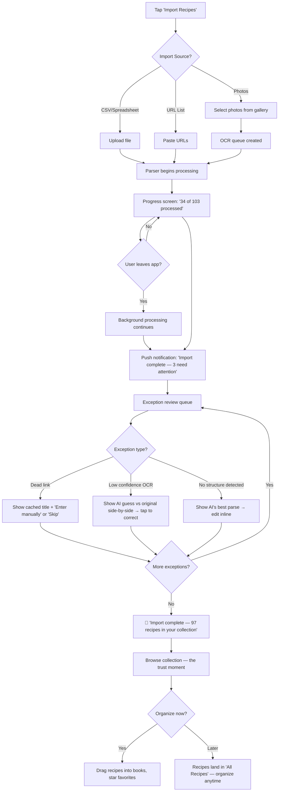
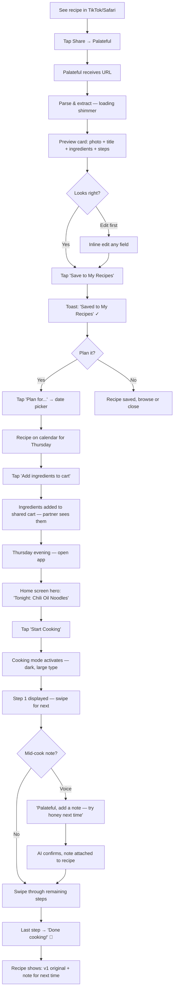
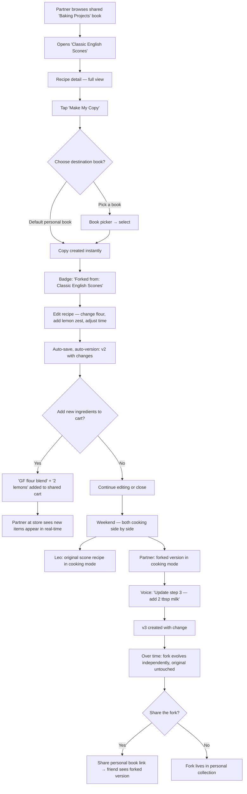
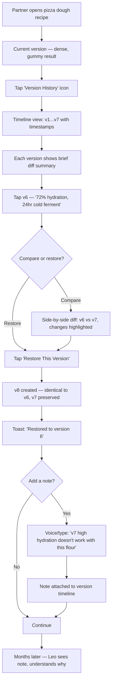
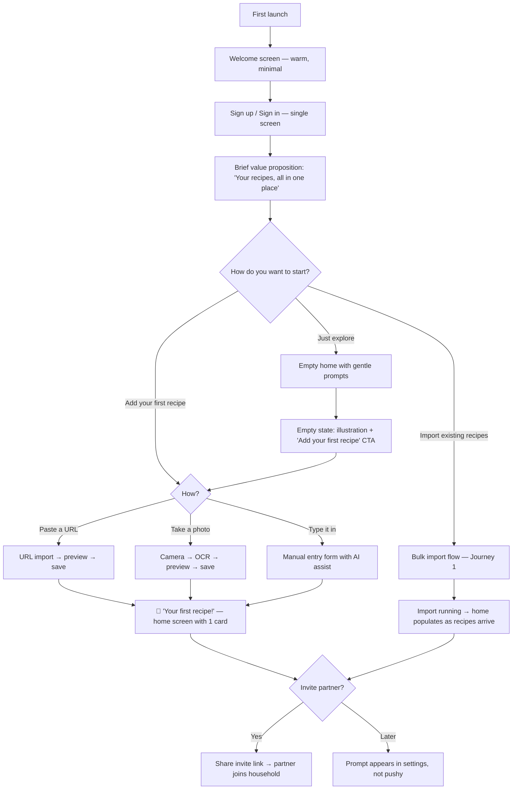
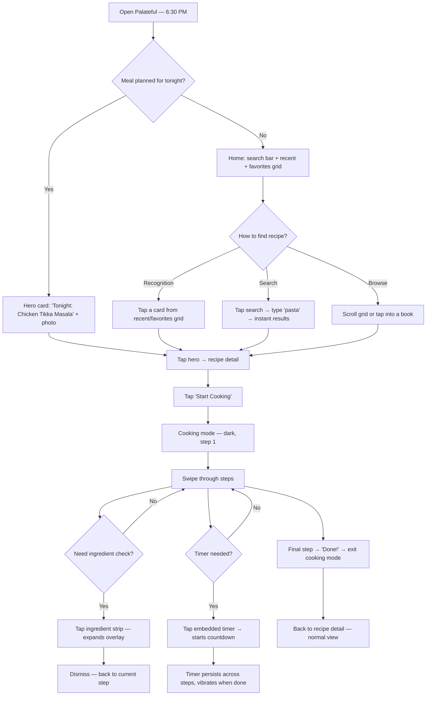
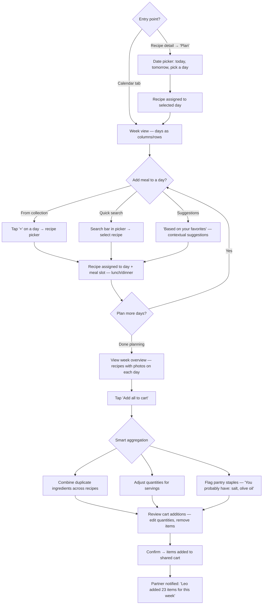
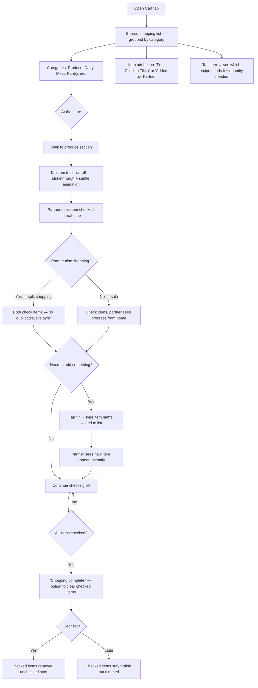
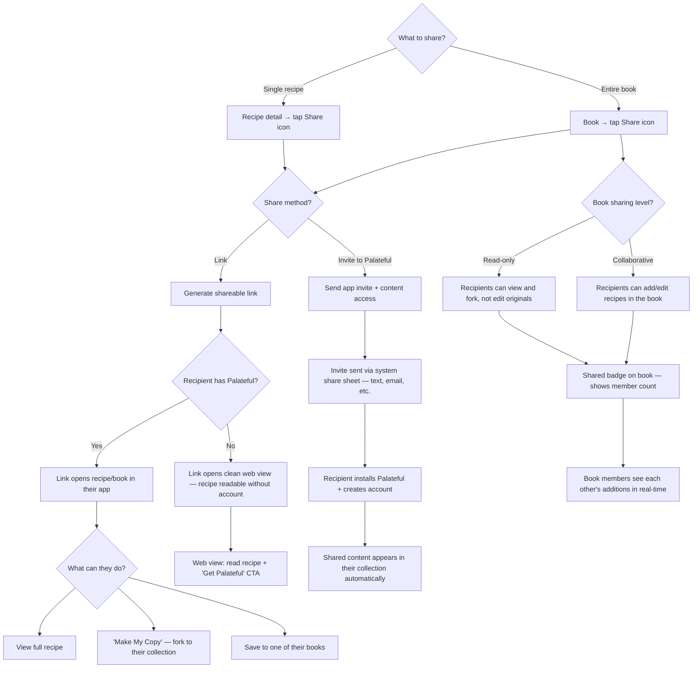

---
stepsCompleted:
  - step-01-init
  - step-02-discovery
  - step-03-core-experience
  - step-04-emotional-response
  - step-05-inspiration
  - step-06-design-system
  - step-07-defining-experience
  - step-08-visual-foundation
  - step-09-design-directions
  - step-10-user-journeys
  - step-11-component-strategy
  - step-12-ux-patterns
  - step-13-responsive-accessibility
  - step-14-complete
inputDocuments:
  - _bmad-output/planning-artifacts/prd.md
  - docs/AUTH0.md
  - docs/BIG_ROCKS.md
  - docs/COST.md
  - docs/DATABASE.md
  - docs/EVAL_DESIGN.md
  - docs/INGREDIENT_SCRAPER_DESIGN.md
  - docs/INVITATION_SYSTEM.md
  - docs/MVP.md
  - docs/OPENAI_AGENT_SETUP.md
  - docs/RECIPE_EXPERIENCE_IMPLEMENTATION.md
  - docs/RECIPE_IMPORT_SYSTEM.md
  - docs/SETUP.md
  - docs/SHARED_SHOPPING_CART.md
  - docs/VERCEL.md
  - docs/ai-tools.md
  - docs/api-reference.md
  - docs/business-logic.md
  - docs/calendar-system.md
  - docs/database-schema.md
  - docs/db-uml-diagram.md
  - docs/ocr-batch-architecture.md
  - docs/search-design.md
---

# UX Design Specification - Palateful

**Author:** Leo
**Date:** 2026-03-12

---

## Executive Summary

### Project Vision

Palateful is a kitchen management platform designed around two distinct UX modes: **curation mode** (couch — browsing, importing, organizing, planning) and **action mode** (kitchen — cooking, shopping, hands-free interaction). The core UX promise is that every touchpoint in the cooking lifecycle is so low-friction that users experiment fearlessly, because nothing is ever lost.

The platform serves a household of two equal partners who cook 2x+ per week, shop collaboratively, and need both personal and shared recipe spaces. The primary device is a mobile phone, typically lying flat on the kitchen counter during cooking. A web companion provides full feature parity for laptop-on-counter cooking.

### Target Users

**Primary User — Leo (Founder)**
Experienced home cook and tech-savvy developer. Currently manages 100+ recipes across Google Sheets and Notion. Core frustration: recipe management is scattered and cooking from recipes involves too much scrolling and finding. Wants a single source of truth that's fast to get into and frictionless to cook from.

**Secondary User — Partner (Household Co-curator)**
Equally active in cooking and shopping. Needs full citizen access — not a guest or secondary account. Will independently add, fork, and iterate on recipes. Shops collaboratively using a shared list (currently a notes app). Expects real-time sync without coordination overhead.

**Future Users — Friends, Family, Community**
Later phases expand to friends/family sharing and public recipe discovery. UX must scale from 2 users to community without redesigning core patterns.

### Key Design Challenges

1. **Flat-phone cooking mode** — Phone lies flat on the counter, viewed from above at ~60° angle and arm's length. Requires large type, high contrast, minimal content per screen, and oversized touch/swipe targets. No scrolling within a step.

2. **Two-mode cognitive shift** — Curation mode is exploratory and detail-rich; action mode is focused and urgent. The UX must feel like two complementary experiences sharing the same data, with clear but seamless transitions.

3. **Recipe findability without scrolling** — Current pain is too much scrolling to find things. Home screen must predict intent using context (time of day, planned meals, recents, favorites). Goal: 1-2 taps to any recipe, zero scrolling past irrelevant content.

4. **Shared-but-individual clarity** — Both partners have personal spaces and shared spaces. The UX must make context obvious (my books vs. shared books) without adding friction or cognitive overhead.

5. **Bulk import confidence** — 100-recipe migration must feel manageable: clear progress, exception-driven review, and a fix flow that doesn't overwhelm.

### Design Opportunities

1. **Zero-scroll home** — A contextually aware home screen (time of day, planned meals, recent activity) that surfaces the right recipe before the user searches. Most sessions start and end here.

2. **Cooking mode as kitchen tool** — When cooking mode activates, the phone becomes a dedicated kitchen instrument: large type, ambient-aware contrast, voice-first interaction, integrated timers. The feature people tell friends about.

3. **Invisible versioning** — Version history as an insurance policy you forget about until you need it, then it feels like a superpower. One tap to see history, one tap to restore, clear visual diffs, zero git terminology.

4. **Ambient collaborative shopping** — A shared cart that feels like a living document passively maintained by both partners. Items appear from meal plans, get checked off in real-time at the store, visible to both without coordination.

## Core User Experience

### Defining Experience

Palateful is a **recipe book app** at its core. The defining experience is building, browsing, and curating a personal recipe collection that feels complete, organized, and instantly accessible. Everything else — cooking mode, AI assistant, shopping cart, meal planning — exists to make the recipe book stickier and more useful after the user trusts it as their single source of truth.

The core loop is: **Find recipe → Use recipe → Improve recipe → Repeat.** The "find" step must be nearly instant. The "use" step must be frictionless. The "improve" step must be invisible. If the collection feels complete and findable, the user never goes back to spreadsheets.

### Platform Strategy

| Platform | Role | Interaction Model |
|----------|------|-------------------|
| iOS (primary) | Full experience — curation + cooking + shopping | Touch-first, phone flat on counter during cooking |
| Android | Same as iOS, shared Flutter codebase | Touch-first, same patterns |
| Web | Full feature parity — curation + cooking from laptop | Mouse/keyboard for curation, touch/voice for cooking mode on laptop-on-counter |

**Offline:** Recipe data cached locally. Cooking mode fully offline. Import, AI, and shopping require network.

**Device capabilities leveraged:** Camera (OCR), microphone (voice AI), share sheet (URL import), haptics (timer feedback), push notifications (import status, partner actions), home screen widgets (timers, next meal).

### Effortless Interactions

These interactions must feel like they require zero thought:

| Interaction | Effortless Target | Current Pain It Solves |
|-------------|-------------------|----------------------|
| **Find tonight's recipe** | Open app → it's right there (1-2 taps, zero scrolling) | Too much scrolling and finding |
| **Import a recipe** | Share from any app → it's in your book | Manual copy-paste from blogs/TikTok |
| **Start cooking** | Tap recipe → cooking mode, no setup screens | Scrolling a blog post while hands are messy |
| **Add a note mid-cook** | Say it → it's persisted to the recipe | Washing hands to type, forgetting the note |
| **Shop together** | Items appear/disappear in real-time, no texting | "Did you already get the lemons?" texts |
| **Migrate everything** | Start import → walk away → fix a few exceptions | Manually re-entering 100 recipes |
| **Go back to what worked** | One tap to see history, one tap to restore | Can't remember last week's version |

### Critical Success Moments

Ordered by impact — the moments that determine whether Palateful becomes the permanent home:

1. **"It's all here"** — After bulk import, scrolling through 97 organized recipes. The spreadsheet is obsolete. This is the **trust moment** — the single event that converts a user from trying-it-out to relying-on-it. Everything in UX should accelerate getting to this moment.

2. **"That was easy"** — First time importing a recipe via share sheet from TikTok/Safari and it just appears, clean and structured, in under 5 seconds. Validates that *adding* to the collection is frictionless.

3. **"Just works mid-cook"** — First successful voice note while hands are messy. Proves the app works in the kitchen, not just on the couch.

4. **"She's using it too"** — Partner independently forks a recipe or adds to the shopping cart. The household model is validated.

5. **"I can go back"** — First version restore. The safety net becomes real. Experimentation becomes fearless.

### Experience Principles

These principles guide every UX decision in Palateful:

1. **Collection first, features second.** The recipe book is the product. Every feature exists to make the collection more complete, more findable, or more useful. If a feature doesn't serve the collection, question it.

2. **Predict, don't make me search.** The home screen should surface the right recipe before the user thinks to search. Context-aware (time of day, planned meals, recents, favorites) beats search-dependent.

3. **Two modes, one app.** Curation mode (couch) is calm, browsable, detail-rich. Action mode (kitchen) is bold, glanceable, voice-first. Transitions between them are seamless but the shift is unmistakable.

4. **Invisible until powerful.** Versioning, lineage, AI — these features should add zero friction to normal use. They surface only when needed, and when they do, they feel like superpowers.

5. **Shared by default, personal by choice.** The household is the natural unit. Shared books, shared cart, shared calendar are the default experience. Personal books are an opt-in for individual experimentation.

## Desired Emotional Response

### Primary Emotional Goals

**"Throw it in, it's handled."** — The primary emotional experience of Palateful is **trusted delegation**. Users should feel like they're tossing recipes, notes, and ideas into a system that quietly organizes, preserves, and surfaces them at the right moment. Minimal effort in, maximum value out. The app earns trust by being competent without being demanding.

| Emotional Goal | Description | When It Matters Most |
|----------------|-------------|---------------------|
| **Trusted permanence** | "It's all here, it's mine, it's not going anywhere" | After bulk import, when browsing collection, after restoring a version |
| **Effortless competence** | "I didn't have to think about that, it just worked" | During import, search, cooking mode, shopping sync |
| **Creative confidence** | "I can experiment because I can always go back" | When editing recipes, trying new versions, forking |
| **Warm familiarity** | "This feels like my cookbook, not an app" | Opening the app, browsing books, returning after days away |
| **Quiet reliability** | "It saved everything and tells me only what I need to know" | Error recovery, import exceptions, background sync |

### Emotional Journey Mapping

| Stage | Desired Feeling | Anti-Feeling to Avoid |
|-------|----------------|----------------------|
| **First open** | "This is going to be easy" — warmth, simplicity, invitation | Overwhelm, complexity, "where do I start?" |
| **Bulk import** | "I started it, it's handling the rest" — delegation, trust | Anxiety about progress, babysitting, item-by-item tedium |
| **Browsing collection** | "This is MY cookbook" — ownership, pride, familiarity | Clutter, lost recipes, "I know I saved that somewhere" |
| **Finding a recipe** | "There it is" — instant recognition, zero friction | Scrolling, searching, filtering, dead ends |
| **Cooking mode** | "I just cook, it just helps" — focus, flow, support | Distraction, small text, "wait what was step 3?" |
| **Something goes wrong** | "No big deal, it's got my back" — calm resilience, protected | Panic, data loss fear, "did I lose my changes?" |
| **Returning after days** | "Right where I left off" — continuity, welcome back | "What was I doing?", stale state, re-orientation effort |
| **Partner interaction** | "We're in this together, effortlessly" — ambient connection | Coordination overhead, "did you see my message?" |

### Micro-Emotions

**Critical micro-emotion pairs for Palateful:**

- **Confidence over confusion** — Every screen should answer "where am I?" and "what can I do?" without the user asking. Navigation is obvious, context is clear.
- **Trust over skepticism** — Import results are shown transparently. Version history is always accessible. Data never disappears without explanation.
- **Calm over anxiety** — Errors are handled gracefully with clear next steps. Nothing is urgent except cooking timers. The app never creates stress.
- **Accomplishment over frustration** — Completing an import, finishing a cook, restoring a version — each should feel like a small win, not relief from a struggle.

### Design Implications

| Emotional Goal | UX Design Approach |
|----------------|-------------------|
| **Trusted permanence** | Visible collection counts ("247 recipes"), version history always one tap away, "never deleted, only archived" messaging |
| **Effortless competence** | Smart defaults, predictive home screen, auto-organized imports, one-tap actions for common tasks |
| **Creative confidence** | Non-destructive editing everywhere, clear "you can always go back" affordances, version restore is prominent not hidden |
| **Warm familiarity** | Soft color palette, recipe photos as visual anchors, book metaphors in organization, personal touches (recipe notes visible) |
| **Quiet reliability** | Notification-only-when-needed pattern, background sync indicators (subtle, not intrusive), error recovery that explains what happened and what was saved |
| **Minimal user effort** | Import via share sheet (1 tap), AI handles structuring, exceptions surfaced as a short review queue not a task list, cooking mode requires zero setup |

### Emotional Design Principles

1. **Be a cookbook, not an app.** Visual design, language, and interaction patterns should evoke a well-loved personal cookbook — warm, organized, personal — not a productivity tool or social media feed.

2. **Demand nothing, deliver everything.** The user throws things in (URLs, photos, voice notes). The system organizes, structures, and preserves. Effort flows one direction: from the app to the user, not the reverse.

3. **Surface only what matters.** Notifications, exceptions, and prompts appear only when user action is genuinely needed. Everything else happens silently. The Claude Code principle: minimal effort from you, maximum competence from the system.

4. **Make safety invisible.** Versioning, archiving, and data permanence should feel like gravity — always there, never thought about. When the user finally needs it, it feels like a superpower they didn't know they had.

5. **Celebrate the collection, not the features.** The emotional center of the app is "look at all my recipes." Features like AI, OCR, and forking are invisible plumbing. The collection is the hero.

## UX Pattern Analysis & Inspiration

### Inspiring Products Analysis

**NYT Cooking — Editorial Warmth & Typography**
NYT Cooking succeeds through *feel* more than features. Beautiful typography (serif headings, generous whitespace), editorial-quality photography, and a reading experience that makes browsing recipes feel like reading a magazine, not using a database. The recipe view is clean and focused — ingredients and steps are clearly separated with excellent typographic hierarchy. What to steal: the font vibes, the visual warmth, the sense that recipes are *content worth reading*, not rows in a spreadsheet. What to skip: the subscription paywall mentality and the editorial-heavy homepage that prioritizes NYT content over your content.

**King Arthur Baking — Recipe Quality as UX**
King Arthur proves that recipe *structure* is a UX feature. Their recipes are immaculately written: precise measurements, clear step ordering, helpful tips inline, and extensive testing notes. The UX lesson isn't visual — it's that well-structured recipe data feels trustworthy. When ingredients are precise and steps are clear, users trust the recipe before they cook it. What to steal: the standard of structured recipe quality as a UX goal — Palateful's AI import pipeline should aspire to King Arthur-level output. What to skip: the content-site bloat (ads, SEO padding, related articles).

**Apple Notes — Radical Simplicity**
Apple Notes is the gold standard for "throw it in, find it later." Zero onboarding, instant capture, fast search, invisible sync. The UX lesson: the best organizational tool is one that requires no organizing. Notes doesn't demand folders, tags, or structure — but supports them when you want them. What to steal: the "just start typing" immediacy, the speed of search, the trust that sync works silently. What to skip: the lack of structure — Palateful needs structured data (ingredients, steps) that Notes can't provide.

**Notion — Customizability with Structure**
Notion shows that users enjoy arranging their space — custom views, flexible layouts, personal organization schemes. The UX lesson: some users want to *curate* their collection, not just store it. Recipe books, tags, and personal organization should feel expressive, not restrictive. What to steal: the sense of ownership over your workspace, the ability to organize *your way*. What to skip: the complexity tax — Notion's flexibility creates a learning curve and decision fatigue that conflicts with Palateful's "demand nothing" principle.

**Recime — Share-to-App Import**
Recime nailed the single most important UX pattern for recipe collection: see a recipe anywhere, share it to the app, done. One tap from TikTok/Safari/Instagram to a structured recipe in your collection. What to steal: the entire share sheet import flow — it's the fastest path from "I want this" to "I have this." What to skip: Recime lacks versioning, collaboration, and cooking mode — it's a collector, not a kitchen companion.

**Claude Code — Trusted Delegation**
The interaction model that defines Palateful's emotional core. Minimal input from the user, maximum competence from the system, surfaces only what requires attention. The UX lesson: the best assistant is one you forget is there until you need it. What to steal: the exception-driven interaction model (handle everything, surface only problems), the feeling of "it's got this." What to skip: the text-heavy interface — Palateful needs visual warmth, not terminal aesthetics.

### Transferable UX Patterns

**Navigation Patterns:**

| Pattern | Source | Application in Palateful |
|---------|--------|-------------------------|
| Tab bar with contextual home | Apple Notes, NYT Cooking | Bottom nav: Home, Books, Cart, Calendar, Profile. Home is context-aware, not static. |
| Search as primary navigation | Apple Notes | Prominent search bar on home — instant, forgiving, always accessible |
| Pull-to-refresh with subtle sync | Apple Notes | Background sync is silent; pull-to-refresh provides manual control without anxiety |

**Interaction Patterns:**

| Pattern | Source | Application in Palateful |
|---------|--------|-------------------------|
| Share sheet import | Recime | See recipe → Share → Palateful → Done. One-tap capture from any app. |
| Exception-driven review | Claude Code | Bulk import runs silently. User reviews only flagged items, not every result. |
| Inline editing with auto-save | Apple Notes | Recipe edits save automatically. No "save" button. Versioning happens invisibly. |
| Swipe gestures for common actions | iOS conventions | Swipe to archive, swipe to add to cart, swipe between cooking steps |

**Visual Patterns:**

| Pattern | Source | Application in Palateful |
|---------|--------|-------------------------|
| Serif headings + sans-serif body | NYT Cooking | Recipe titles in warm serif font, body text in clean sans-serif. Editorial feel. |
| Photography as visual anchor | NYT Cooking, King Arthur | Recipe hero images are large and prominent. The collection feels visual, not textual. |
| Generous whitespace | NYT Cooking, Apple Notes | Breathing room between elements. Calm, not cramped. |
| Subtle color palette | Apple Notes | Warm neutrals with muted accents. Not vibrant/playful — warm/trustworthy. |

### Anti-Patterns to Avoid

| Anti-Pattern | Where It's Seen | Why It Fails for Palateful |
|-------------|----------------|---------------------------|
| **Content-site bloat** | Food blogs, King Arthur site | Ads, life stories before recipes, SEO padding. Palateful recipes should be clean, structured, zero bloat. |
| **Complexity-first organization** | Notion | Forcing users to set up databases, views, and templates before they can use the tool. Conflicts with "demand nothing." |
| **Subscription gating of core features** | NYT Cooking | Core recipe storage and cooking should never be paywalled. Trust requires unrestricted access to YOUR data. |
| **Social feed as homepage** | Cookpad, some recipe apps | The home screen should show YOUR recipes, not a feed of strangers' content. Collection first, community later. |
| **Tiny touch targets in cooking context** | Most recipe apps | Standard mobile button sizes fail when hands are messy and phone is flat on counter. Cooking mode needs oversized everything. |
| **Manual save/sync** | Older apps | If the user has to think about saving, we've failed. Auto-save, auto-sync, auto-version. |

### Design Inspiration Strategy

**Adopt Directly:**
- Recime's share-to-app import flow — proven, simple, essential
- Apple Notes' invisible sync and auto-save model — trust through silence
- Claude Code's exception-driven interaction — surface only what needs attention
- NYT Cooking's typographic hierarchy — serif headings, generous whitespace, editorial warmth

**Adapt for Palateful:**
- NYT Cooking's visual warmth → apply to a personal collection (YOUR recipes look beautiful), not editorial content
- Notion's organizational flexibility → offer recipe books and tags, but with sensible defaults so organization is optional, not required
- King Arthur's recipe structure quality → use as the target output for AI import pipeline, not as a content standard users must maintain manually

**Avoid Explicitly:**
- Notion's complexity tax — no setup required, no configuration screens, sensible defaults everywhere
- Food blog visual patterns — no life stories, no ads, no scroll-past-the-content
- Social feed homepages — your collection is the hero, not a discovery feed (until Phase 4 Community)
- Any pattern that requires the user to think about data management (saving, syncing, backing up, organizing)

## Design System Foundation

### Design System Choice

**Material 3 (Flutter) — heavily themed with Palateful's existing cream & chocolate identity.**

The existing codebase already implements a comprehensive Material 3 theme with a custom warm color palette. The design system builds on this foundation rather than replacing it. Dark mode uses a warm inversion (chocolate background, warm ivory text) that preserves brand identity rather than introducing cold tones.

### Rationale for Selection

1. **Already built.** A complete `AppTheme` and `AppColors` system exists in `app/lib/core/theme/` with 40+ color tokens, component-level theming for buttons, cards, inputs, navigation, dialogs, snackbars, and more. Starting over would be wasteful.
2. **Material 3 infrastructure.** Flutter's M3 gives us accessibility, responsive layouts, adaptive components, and platform conventions for free. The visual layer is already overridden to feel like Palateful, not Google.
3. **Solo developer velocity.** One developer maintaining a custom design system is a maintenance burden. Material 3 as infrastructure + custom theme tokens = maximum speed with minimum upkeep.
4. **The palette already matches the emotional goals.** Cream/chocolate/hazelnut evokes "well-loved cookbook" — warm, personal, trustworthy. This isn't a design system that needs to be fought against.

### Existing Color System

**Primary Palette — Cream & Beige (backgrounds, surfaces)**

| Token | Hex | Role |
|-------|-----|------|
| `cream` | #FAF7F2 | Main background — warm cream white |
| `creamLight` | #FFFDF9 | Cards and elevated surfaces |
| `beige` | #F5EFE6 | Subtle secondary backgrounds |
| `beigeAccent` | #E8DFD0 | Borders and dividers |
| `warmWhite` | #FEFCF9 | Dialogs, bottom sheets |

**Secondary Palette — Chocolate & Hazelnut (accents, interactive elements)**

| Token | Hex | Role |
|-------|-----|------|
| `chocolate` | #4A3728 | Primary accent — buttons, nav active, FAB |
| `chocolateLight` | #5D4A3A | Hover states |
| `chocolateDark` | #3A2A1E | Pressed states |
| `hazelnut` | #8B7355 | Secondary accent — outline buttons, focus borders |
| `hazelnutLight` | #A89076 | Subtle interactive accents |

**Accent Colors**

| Token | Hex | Role |
|-------|-----|------|
| `terracotta` | #BE8A60 | Highlights, tertiary accent |
| `sage` | #8FA882 | Success states |
| `coral` | #CB8B73 | Warnings |
| `dustyRose` | #B86B6B | Errors (softer than red) |

**Text Hierarchy**

| Token | Hex | Role |
|-------|-----|------|
| `textPrimary` | #2D2420 | Primary text — warm dark brown |
| `textSecondary` | #6B5D54 | Secondary/supporting text |
| `textTertiary` | #9C8E84 | Hints, placeholders, inactive labels |
| `textDisabled` | #BEB5AC | Disabled elements |

### Implementation Approach

**What exists and should be preserved:**
- Complete `AppColors` class with 35+ named color tokens organized by role
- Full `AppTheme.light` with component-level overrides (app bar, cards, buttons, inputs, chips, lists, dialogs, bottom sheets, snackbars, navigation, tabs)
- Consistent 12px border radius for interactive elements, 16px for cards, 20px for dialogs/sheets
- Minimum 48dp touch targets on buttons (already set)
- State-aware color resolution (hover, pressed, disabled) on all interactive components

**What needs to be added for UX spec:**
- **Typography upgrade** — Current theme uses system font. Consider adding a warm serif font for recipe titles (NYT Cooking inspiration) while keeping sans-serif for body/UI text.
- **Cooking mode theme variant** — A high-contrast sub-theme for kitchen use: larger text sizes, bolder colors, increased touch target minimums (64dp+), potentially inverted palette (chocolate background, cream text) for glanceability from above.
- **Spacing scale** — Formalize a spacing system (4, 8, 12, 16, 24, 32, 48) that the existing theme hints at but doesn't explicitly define.
- **Recipe card component** — A custom component for the visual hero of the app: recipe photo + title + metadata, used across home screen, books, and search results.
- **Animation tokens** — The existing 150-200ms animation durations are good. Codify interaction timing: subtle transitions (150ms), state changes (200ms), page transitions (300ms).

### Customization Strategy

**Light + warm dark mode.** Both modes use the same cream/chocolate palette — they invert it. The "warm cookbook" identity is preserved in dark mode through warm ivory text and terracotta accents rather than cold whites and blues.

**Extend, don't replace.** The existing Material 3 theme is well-implemented. Customization happens by:
1. Adding a serif `fontFamily` for display/headline text styles (recipe titles, section headers)
2. Adding an `AppTheme.dark` variant with warm palette inversion
3. Creating a `CookingModeTheme` sub-theme (inherits from dark) with larger sizes and 64dp+ touch targets
4. Building custom widgets for recipe-specific components (recipe cards, ingredient strips, step cards, timer widgets) that compose Material components with Palateful styling
5. Defining a formal spacing and sizing scale as constants

**Component strategy:**
- **Use Material directly:** Buttons, inputs, dialogs, bottom sheets, chips, switches, checkboxes, navigation bar, tab bar, snackbars, progress indicators — all already themed
- **Build custom:** Recipe card, cooking step card, ingredient strip, timer widget, shopping list item, version history timeline, import review card

## Defining Experience

### The Core Interaction

**"Curate your Cookbook."**

The defining experience of Palateful is the ongoing act of building, tending, and cooking from a personal recipe collection that grows with you. Users describe it as: "It's MY cookbook — I throw recipes in from anywhere, organize them how I want, iterate on them fearlessly, and cook from them hands-free."

This is not a single interaction — it's a relationship with a living collection. Every feature serves curation: import makes the collection grow, versioning makes iteration safe, forking makes collaboration generative, cooking mode makes the collection useful, and the home screen makes the collection feel alive and accessible.

### User Mental Model

**The mental model is a physical cookbook — upgraded.**

Users think of Palateful as a digital version of the cookbook they've always wanted: one that contains EVERYTHING, never loses a page, lets them scribble notes in the margins, and magically reorganizes itself to show what they need. The metaphor is physical (books, pages, collections) but the capabilities are digital (search, version history, forking, AI assistance).

**How users currently solve this:**
- Google Sheets / Notion — flexible but zero cooking UX, no structure, no import
- Bookmarked URLs — links break, no offline, buried in browser noise
- Physical cookbooks — beautiful but unsearchable, can't iterate, can't share easily
- Screenshot folders — unstructured, unsearchable, no ingredients/steps separation

**What they love about current solutions:** The freedom of spreadsheets (put anything anywhere), the permanence of physical books (it's MINE), the beauty of editorial recipe sites (NYT Cooking feels premium).

**What they hate:** Scattered across 5 places, nothing talks to each other, can't cook from a spreadsheet, can't search a screenshot, links die, no version history when you tweak a recipe.

**The Palateful shift:** One place that combines the freedom of a spreadsheet, the permanence of a physical book, the beauty of NYT Cooking, and the intelligence of an AI assistant — without the downsides of any of them.

### Success Criteria

The "Curate your Cookbook" experience succeeds when:

| Criterion | Signal | Measurement |
|-----------|--------|-------------|
| **Collection feels complete** | User stops maintaining spreadsheet/Notion | Old sources abandoned within 2 weeks of bulk import |
| **Adding is effortless** | User imports recipes without thinking about it | Share-to-app import completes in <5 seconds, user does it 3+x/week |
| **Finding is instant** | User never says "where's that recipe?" | Recipe found in 1-2 taps from home screen or 1 search query |
| **Iterating is fearless** | User edits recipes without hesitation | Version history accessed at least once; user restores a version |
| **Cooking is hands-free** | User cooks without touching the phone to navigate | Full cook session completed using voice + swipe only |
| **Collection grows naturally** | Recipes accumulate without deliberate effort | 10+ new recipes added per month after initial import |
| **It feels MINE** | User takes pride in their collection | User shares a recipe or book with someone unprompted |

### Novel UX Patterns

**Mostly established patterns, combined in novel ways:**

| Pattern | Type | Notes |
|---------|------|-------|
| Recipe card browsing | Established | Standard card grid/list — like any recipe app or Pinterest |
| Share sheet import | Established | Recime proved this works — adopt directly |
| Search with fuzzy/semantic matching | Established | Standard search bar — novel only in quality of results |
| Cooking mode step-by-step | Established | Many apps do this — our twist is flat-phone optimization + voice |
| **Auto-versioning on edit** | Novel | No recipe app does this. Metaphor: "it's like Google Docs history for recipes" — users understand immediately |
| **Recipe forking with lineage** | Novel | Borrows from GitHub but needs zero explanation: "Make your own copy." Badge shows origin. |
| **Exception-driven bulk import** | Novel | No recipe app offers fire-and-forget migration. Needs clear progress + notification UX to build trust. |
| **Contextual zero-scroll home** | Novel combination | Individual patterns are established (recents, favorites, calendar) but combining them into a predictive, zero-scroll home screen is the innovation. |

**Teaching novel patterns:**
- **Versioning:** No teaching needed — it's invisible. Users discover it when they need it. The "Version History" button is always visible on recipe detail but never demanded.
- **Forking:** "Make My Copy" button on any recipe you don't own. The lineage badge ("Forked from: Classic Scones") is the only education needed.
- **Bulk import:** Onboarding offers it as the first action. Progress UI builds trust. Exception review is a short, card-based flow — not a spreadsheet of errors.

### Experience Mechanics

**The "Curate your Cookbook" loop:**

**1. Initiation — Growing the Collection**

| Entry Point | Trigger | Interaction | Outcome |
|------------|---------|-------------|---------|
| Share sheet | See recipe anywhere → Share → Palateful | One tap, zero typing | Recipe appears in default book in <5s |
| URL paste | Copy link → open app → auto-detect clipboard | Prompt: "Import this recipe?" → Yes | Structured recipe created |
| Camera/OCR | Photograph physical recipe | Tap camera → snap → processing | Structured recipe created (review if low confidence) |
| Bulk import | Onboarding or settings | Upload CSV/URL list → walk away | Notification when done, exceptions queued |
| Manual create | Tap "+" on any book | Structured form with AI assist | Recipe created with auto-save |
| Fork | Browse shared/public recipe → "Make My Copy" | One tap | Copy in personal book, lineage tracked |

**2. Interaction — Tending the Collection**

| Action | Interaction | System Response |
|--------|-------------|----------------|
| Browse | Open app → home screen shows contextual recipes | Zero-scroll access to recent, favorites, planned meals |
| Search | Tap search → type anything | Instant results: exact → fuzzy → semantic |
| Organize | Drag to book, add tags, star favorites | Immediate, auto-saved, no confirmation dialogs |
| Edit | Tap recipe → edit any field | Auto-save, version snapshot on meaningful change |
| Annotate | Voice or text: "add a note" | Note attached to current version, visible in timeline |
| Archive | Swipe → archive | Removed from active views, restorable anytime |

**3. Feedback — Knowing It's Working**

| Signal | UX Pattern |
|--------|------------|
| Collection growing | Recipe count visible on home ("247 recipes") |
| Import succeeded | Subtle toast: "Recipe saved to [Book Name]" |
| Version saved | No notification — invisible. History icon shows count if user looks. |
| Sync working | No indicator when working. Subtle icon only when offline/syncing. |
| Error occurred | Gentle notification with clear next step, never alarming |

**4. Completion — Using the Collection**

| Action | Flow | Outcome |
|--------|------|---------|
| Cook | Recipe → "Start Cooking" → cooking mode | Hands-free step-by-step with timers and voice AI |
| Shop | Recipe → "Add to Cart" or calendar → auto-aggregate | Items in shared list, synced with partner in real-time |
| Plan | Recipe → drag to calendar or "Plan for Thursday" | Meal scheduled, ingredients optionally queued to cart |
| Share | Recipe → share link or invite to book | Recipient gets clean recipe or book access |
| Restore | Recipe → Version History → tap any version → "Restore" | New version created from old, history preserved |

## Visual Design Foundation

### Color System

**Established — using existing `AppColors` palette (see Design System Foundation section).**

The color system is already implemented and documented. Key design decisions:

- **Light + warm dark mode** — cream/chocolate palette inverts warmly (chocolate bg, warm ivory text) rather than going cold/grey
- **Warm throughout** — even semantic colors (sage success, dusty rose errors, warm amber warnings) stay in the warm family. No jarring blues or neon accents.
- **Chocolate as the anchor** — primary interactive elements (#4A3728) ground the interface in warmth. Hazelnut (#8B7355) provides a softer secondary tier.
- **Cream as canvas** — #FAF7F2 background feels like quality paper, not sterile white. Cards (#FFFDF9) float subtly above.

**Contrast ratios (verified against WCAG AA):**

| Pairing | Ratio | WCAG AA |
|---------|-------|---------|
| `textPrimary` (#2D2420) on `cream` (#FAF7F2) | ~12.5:1 | Pass (requires 4.5:1) |
| `textSecondary` (#6B5D54) on `cream` (#FAF7F2) | ~5.2:1 | Pass |
| `textTertiary` (#9C8E84) on `cream` (#FAF7F2) | ~3.1:1 | Pass for large text only |
| `cream` (#FAF7F2) on `chocolate` (#4A3728) | ~8.5:1 | Pass — key for cooking mode inverted |

### Typography System

**Font Pairing: Playfair Display (serif) + System Sans-Serif**

| Role | Font | Weight | Usage |
|------|------|--------|-------|
| **Display / Headlines** | Playfair Display | 600-700 | Recipe titles, section headers, book names, home screen headings |
| **Body / UI** | System font (SF Pro on iOS, Roboto on Android) | 400-600 | Ingredients, steps, labels, buttons, navigation, all UI text |

**Rationale:** Playfair Display evokes NYT Cooking's editorial warmth — it says "this is content worth reading, not a database." System sans-serif for body/UI keeps readability high and avoids custom font loading for the bulk of text. The contrast between serif headings and sans body creates natural visual hierarchy without needing color or size alone.

**Type Scale:**

| Style | Font | Size | Weight | Line Height | Letter Spacing | Usage |
|-------|------|------|--------|-------------|----------------|-------|
| Display Large | Playfair | 36px | 700 | 1.2 | -0.5px | Home screen hero text |
| Display Medium | Playfair | 28px | 700 | 1.25 | -0.3px | Recipe title on detail page |
| Display Small | Playfair | 24px | 600 | 1.3 | -0.2px | Section headers, book names |
| Title Large | Playfair | 22px | 600 | 1.3 | -0.1px | Recipe card titles |
| Title Medium | System | 16px | 600 | 1.4 | 0.15px | Sub-headers, form labels |
| Title Small | System | 14px | 600 | 1.4 | 0.1px | Card metadata headers |
| Body Large | System | 16px | 400 | 1.5 | 0.15px | Recipe steps, descriptions |
| Body Medium | System | 14px | 400 | 1.5 | 0.25px | Ingredients, secondary content |
| Body Small | System | 12px | 400 | 1.4 | 0.4px | Timestamps, tertiary info |
| Label Large | System | 14px | 600 | 1.2 | 0.1px | Buttons, tabs |
| Label Small | System | 11px | 500 | 1.2 | 0.5px | Badges, chips, captions |

**Cooking Mode Typography Override:**

| Style | Size | Weight | Notes |
|-------|------|--------|-------|
| Step text | 24px+ | 500 | Readable from arm's length, flat on counter |
| Ingredient | 20px+ | 400 | Floating strip, scannable at a glance |
| Timer | 48px+ | 700 | Dominant visual, readable from across kitchen |
| Step number | 32px | 700 | Clear progress indicator |

### Spacing & Layout Foundation

**Spacing Scale (4px base unit):**

| Token | Value | Usage |
|-------|-------|-------|
| `xxs` | 4px | Tight internal spacing (icon-to-label, badge padding) |
| `xs` | 8px | Compact element spacing (chip gaps, inline elements) |
| `sm` | 12px | Default internal padding (card content, list item padding) |
| `md` | 16px | Standard element spacing (between cards, section gaps) |
| `lg` | 24px | Section spacing (between content groups) |
| `xl` | 32px | Major section breaks (between page sections) |
| `xxl` | 48px | Page-level spacing (top/bottom margins, hero areas) |

**Layout Principles:**

1. **Generous whitespace.** Airy, spacious layouts that breathe. The app should feel like a coffee table cookbook, not a spreadsheet. When in doubt, add more space.
2. **Content-first hierarchy.** Recipe photos and titles are the largest elements. Metadata (prep time, servings, tags) is secondary. UI chrome (navigation, buttons) is minimal.
3. **Single-column on mobile.** Recipes, steps, and content flow in a single column. No side-by-side layouts that compete for attention on a phone screen. Cards stack vertically.
4. **Edge-to-edge photos.** Recipe hero images extend to screen edges (no padding) for visual impact. Text content has 16px horizontal padding.
5. **Consistent card pattern.** Recipe cards are the primary visual element — photo + Playfair title + metadata. Used identically across home, books, search, and calendar.

**Grid System:**

| Context | Structure | Notes |
|---------|-----------|-------|
| Mobile (default) | Single column, 16px horizontal margins | Content fills width minus margins |
| Recipe card grid | 2 columns on phone, 3 on tablet | Card aspect ratio consistent, photo dominant |
| Cooking mode | Full screen, no margins | Maximum use of screen real estate |
| Web (desktop) | Max 720px content width, centered | Prevents ultra-wide line lengths, cookbook feel |
| Web (cooking mode) | Max 900px, centered with large type | Laptop-on-counter optimized |

**Component Spacing:**

| Component | Internal Padding | External Margin | Notes |
|-----------|-----------------|----------------|-------|
| Recipe card | 0 (photo flush) + 12px text area | 8px between cards | Photo bleeds to card edge |
| Navigation bar | 8px vertical | 0 (flush to screen edge) | Minimal chrome |
| Section header | 0 | 24px top, 12px bottom | Playfair serif, generous breathing room above |
| Search bar | 12px internal | 16px horizontal, 8px vertical | Prominent but not dominating |
| Cooking step card | 24px all sides | 0 (full screen) | Extra padding for readability at distance |
| Shopping list item | 12px vertical, 16px horizontal | 0 (tight list, dividers between) | Dense but tappable (48dp min height) |

### Accessibility Considerations

**Visual Accessibility:**
- All text meets WCAG AA contrast ratios against its background (verified in color system above)
- `textTertiary` (#9C8E84) used only for large text (14px+) or non-essential labels — never for critical information
- Cooking mode uses high-contrast pairing: cream on chocolate or chocolate on cream, both exceeding 8:1 ratio
- Error states use `dustyRose` (#B86B6B) PLUS an icon — never color alone to communicate state

**Touch Accessibility:**
- Minimum 48dp touch targets on all interactive elements (already enforced in theme)
- Cooking mode minimum 64dp touch targets (messy hands, flat phone)
- Swipe gestures always have a tap alternative (swipe to archive, but also long-press menu)

**Typography Accessibility:**
- Body text minimum 14px, never smaller for readable content
- Cooking mode minimum 20px for all content, 24px+ for step text
- Line height 1.4-1.5 for body text ensures readability
- No all-caps text blocks — title case for headings, sentence case for body

**Motion Accessibility:**
- Respect system "Reduce Motion" preference — disable page transitions and animations when enabled
- No auto-playing animations or attention-grabbing motion
- Timer animations are functional (countdown), not decorative

## Design Direction Decision

### Design Directions Explored

Three rounds of HTML mockups explored different visual approaches for Palateful's key screens:

**V1 — Three Home Screen Directions + Cooking Mode:**
- **Direction A (Editorial):** Full-bleed hero image, editorial feel, NYT Cooking-inspired. Strong visual impact but limited recipe density.
- **Direction B (Card Grid):** 2-column card grid with prominent search bar. High density, good browsability, feels like a collection.
- **Direction C (List-Centric):** Compact list layout, maximum density, scannable. Efficient but lacked the visual warmth of the recipe card approach.
- **Cooking Mode:** Two variants explored — dark background with cream text, and light background with chocolate text.

**V2 — Hybrid Home + Warm Ivory Exploration:**
- Combined the best of all three V1 directions into a hybrid home screen: conditional hero card (tonight's planned meal) + persistent search bar + 2-column card grid + contextual sections (recent, favorites).
- Explored warm ivory (#F5ECD7) vs pure cream for cooking mode dark text — warm ivory won for its cohesive warmth.

**V3 — Full Light vs Dark Side-by-Side:**
- All four key screens (Home with Hero, Home without Hero, Recipe Detail, Cooking Mode) shown in light mode and dark mode side-by-side.
- Light mode: cream (#FAF7F2) background, chocolate (#4A3728) text.
- Dark mode: chocolate (#4A3728) background, warm ivory (#F5ECD7) text, terracotta (#BE8A60) replaces chocolate as primary accent.

### Chosen Direction

**Hybrid home screen with full light/dark mode support.**

The chosen direction combines elements from all explorations into a cohesive vision:

**Home Screen:**
- Conditional hero card at top when a meal is planned for today — large photo, Playfair Display title, "Start Cooking" CTA
- Persistent search bar always visible below hero (or at top when no hero)
- 2-column card grid for the recipe collection — photo-dominant cards with Playfair titles
- Contextual sections: Recently Cooked, Favorites, Your Books
- When no meal is planned, the search bar and card grid take over as the primary experience

**Recipe Detail:**
- Edge-to-edge hero photo
- Playfair Display recipe title, clean metadata row (prep time, servings, difficulty)
- Clear ingredient/step separation
- Prominent "Start Cooking" button
- Version history and "Make My Copy" (fork) as secondary actions

**Cooking Mode:**
- Always dark: chocolate (#4A3728) background, warm ivory (#F5ECD7) text
- One step per screen, large type (24px+), swipe between steps
- Floating ingredient strip for quick reference
- Timer integration with 48px+ numerals
- Voice AI access for hands-free notes and questions
- Minimal chrome — the step content is the entire screen

**App-Wide Dark Mode:**
- Full dark mode across all screens, not just cooking mode
- Palette inversion: chocolate background, warm ivory text, terracotta as primary accent
- Surface hierarchy: `#4A3728` (background) → `#5D4A3A` (elevated surfaces) → `#6B5D54` (tertiary surfaces)
- Secondary text: hazelnutLight (#A89076) maintains readable contrast on dark surfaces

### Design Rationale

1. **Hybrid home predicts intent.** The conditional hero card surfaces tonight's recipe without searching. The card grid provides collection browsing. The search bar catches everything else. Together, they deliver the "zero-scroll home" principle — most sessions start and end on this screen.

2. **Dark mode enhances the brand rather than fighting it.** The warm inversion (chocolate ↔ cream) maintains Palateful's identity in both modes. Unlike generic dark modes that turn warm UIs cold, this approach keeps the "well-loved cookbook" feeling by using warm ivory instead of pure white and terracotta instead of generic accent colors.

3. **Cooking mode's dark-always design is a kitchen UX decision.** Reduced glare on counter, high contrast readable at arm's length, and a clear visual shift that signals "you're cooking now." The warm ivory text at 8.5:1 contrast on chocolate exceeds WCAG AAA requirements.

4. **Playfair Display serif titles create the editorial warmth** that distinguishes Palateful from utility recipe apps. The serif/sans-serif pairing (Playfair for titles, system font for UI) borrows NYT Cooking's sophistication while staying performant.

5. **Photo-dominant cards make the collection feel visual and personal.** The recipe photo is the largest element on every card — users recognize recipes by sight, not by reading titles. This supports the "it's MY cookbook" emotional goal.

### Implementation Approach

**Theme Architecture:**
- Extend existing `AppTheme` with a `.dark` variant alongside the current `.light`
- Dark theme uses the same `AppColors` tokens — the mapping changes, not the palette
- `CookingModeTheme` inherits from dark theme with cooking-specific overrides (larger sizes, 64dp touch targets)

**Dark Mode Token Mapping:**

| Role | Light Mode | Dark Mode |
|------|-----------|-----------|
| Background | cream (#FAF7F2) | chocolate (#4A3728) |
| Surface/Cards | creamLight (#FFFDF9) | chocolateLight (#5D4A3A) |
| Primary text | textPrimary (#2D2420) | warmIvory (#F5ECD7) |
| Secondary text | textSecondary (#6B5D54) | hazelnutLight (#A89076) |
| Primary accent | chocolate (#4A3728) | terracotta (#BE8A60) |
| Secondary accent | hazelnut (#8B7355) | hazelnutLight (#A89076) |
| Borders/dividers | beigeAccent (#E8DFD0) | hazelnut (#8B7355) |

**New Color Token Required:**
- `warmIvory` (#F5ECD7) — primary text color in dark mode, also used in cooking mode. Currently this hex matches `beige` in the light palette but serves a semantically different role in dark mode.

**Screen Priority for Implementation:**
1. Home screen (hero + grid + search — the screen users see most)
2. Recipe detail (the core content experience)
3. Cooking mode (the differentiated feature)
4. Recipe books / collection views
5. Shopping cart, calendar, settings

## User Journey Flows

Nine critical user journeys covering the full Palateful experience — from first open through daily use, collaboration, and growth.

### Journey 1: "The Great Migration" — Bulk Import

**Entry:** Onboarding prompt or Settings → Import

**Key interactions:**
- Progress screen is glanceable — user can leave and come back
- Exception review is card-based, one at a time, swipe to resolve
- The "97 recipes" celebration screen is the critical trust moment — collection count prominent, scroll through thumbnails
- No forced organization — recipes are usable immediately in "All Recipes"

**Error recovery:**
- Network failure mid-import → resume from last successful item, no duplicates
- Unprocessable item → skip with explanation, user can retry individually later

### Journey 2: "The TikTok Find" — Discover → Cook in One Evening

**Entry:** Share sheet from any app (TikTok, Safari, Instagram, etc.)

**Key interactions:**
- Share sheet → preview in <5 seconds. Preview is the decision point, not a loading screen.
- "Plan for..." uses a quick date picker (today, tomorrow, this week) — not a full calendar view
- "Add ingredients to cart" is one tap with smart defaults (serves 2, skip pantry staples toggle)
- Cooking mode transition is unmistakable — screen darkens, type enlarges, chrome disappears
- Voice note requires zero hand interaction — wake word or always-listening during cooking mode

### Journey 3: "The Fork" — Partner Creates Their Version

**Entry:** Browsing a shared book → recipe detail

**Key interactions:**
- "Make My Copy" is the fork button — no git terminology. One tap, instant copy.
- Lineage badge is subtle but always visible — tapping it navigates to the original
- Edits auto-save and auto-version. No "save" button. The fork diverges naturally.
- Shopping cart items from forked recipes are attributed ("Added by [Partner] for GF Scones")

### Journey 4: "The Save" — Version History Rescue

**Entry:** Recipe detail → Version History

**Key interactions:**
- Version history is a vertical timeline — newest at top, scrollable
- Each entry: timestamp + auto-generated summary ("Changed hydration to 80%, ferment to 18hr")
- Diff view highlights changes in ingredient quantities and step text — not a raw text diff
- Restore creates a NEW version (non-destructive) — never deletes history
- Notes can be attached to any version in the timeline, visible inline

### Journey 5: "First Open" — Onboarding

**Entry:** App Store install → first launch

**Key interactions:**
- Onboarding is 2-3 screens max — no tutorial carousel
- The three starting paths cover every user type: migrator (bulk), discoverer (single import), explorer (browse first)
- Empty state is warm, not sad — illustration of a cookbook with "Your collection starts here"
- Partner invite is offered once, gently, then lives in settings
- First recipe saved triggers a subtle celebration — the collection has begun

### Journey 6: "The Weeknight" — Daily Zero-Scroll Cook

**Entry:** Open app on a weeknight

**Key interactions:**
- The hero card means: open app → tap → tap "Start Cooking" = 2 taps to cooking mode
- Without a plan: search or visual recognition from the card grid. Target: still <5 seconds to recipe.
- Cooking mode: one step per screen, swipe horizontal for next/previous
- Ingredient strip: floating at top, collapsed by default, tap to expand full list
- Timers are inline in steps ("Simmer for 15 min" has a tap-to-start timer) and persist across step navigation

### Journey 7: "The Plan" — Weekly Meal Planning

**Entry:** Calendar tab or "Plan" action from recipe

**Key interactions:**
- Calendar is week-focused, not month — meal planning is a weekly ritual
- Recipe picker is the same card grid/search used everywhere — consistent pattern
- "Add all to cart" does smart aggregation: if two recipes need onions, it combines them
- Pantry staples detection: common items (salt, oil, butter) flagged as "you probably have this" — toggleable
- Cart additions are reviewable before confirming — one screen to adjust quantities or remove items
- Partner gets a single notification summarizing what was added, not per-item spam

### Journey 8: "The Shop" — Real-Time Shared Cart at the Store

**Entry:** Cart tab (from bottom nav)

**Key interactions:**
- Items grouped by store category (produce, dairy, meat, pantry, bakery, frozen) — not by recipe
- Each item shows origin: which recipe/meal plan added it, or "manually added by [name]"
- Tapping an item expands: quantity, which recipe(s) need it, who added it
- Check-off is instant, syncs in <1 second — both partners can shop simultaneously without coordination
- Manual additions ("oh we need paper towels") work the same as recipe-sourced items
- "Clear checked" is the completion action — unchecked items persist for next trip

**Error recovery:**
- Offline at store → items cache locally, check-offs sync when reconnected, conflicts auto-resolve (checked wins)
- Accidental check → tap again to uncheck

### Journey 9: "The Share" — Sharing with Friends & Family

**Entry:** Recipe detail or Book → Share

**Key interactions:**
- **Single recipe share:** generates a link that works for anyone — Palateful users see it in-app, non-users get a beautiful web view (recipe is readable, not gated)
- **Book share:** two levels — read-only (view + fork) or collaborative (full edit access)
- **Non-user experience:** clean web page with recipe content + subtle "Get Palateful" CTA. No signup wall to READ a recipe. This is the growth loop — recipes shared look good enough that people want the app.
- **Fork from share:** "Make My Copy" works the same whether you're forking from a shared book or a shared link — lineage tracked either way
- Shared books show a member badge and list — "Shared with: Leo, Partner, Mom"

### Journey Patterns

Patterns that recur across all nine journeys:

| Pattern | Used In | Description |
|---------|---------|-------------|
| **One-tap capture** | J1, J2, J3, J8 | Share sheet, "Make My Copy," "Add to Cart" — single tap to capture/save with smart defaults |
| **Exception-driven review** | J1, J2 | System handles 95% automatically, surfaces only the 5% that need human judgment |
| **Progressive disclosure** | J5, J6, J7 | Show the minimum needed, expand on demand (ingredient strip, version history, cart item details) |
| **Real-time ambient sync** | J3, J7, J8 | Changes appear for partners without notification spam — visible when looking, silent when not |
| **Non-destructive actions** | J3, J4, J9 | Fork, version restore, archive — nothing is ever deleted, everything is restorable |
| **Contextual prediction** | J6, J7 | Home screen hero, recipe suggestions in meal planner — system predicts intent from context |
| **Mode transition** | J2, J6 | Clear shift from curation (browsing) to action (cooking) — unmistakable visual change |
| **Celebration moments** | J1, J2, J5 | First recipe, import complete, shopping done — small wins acknowledged with subtle delight |

### Flow Optimization Principles

1. **Maximum 2 taps to value.** Open app → tonight's recipe → cooking mode. Import → it's running. Share → it's saved. If a common action takes 3+ taps, redesign.

2. **Smart defaults eliminate decisions.** Recipes save to "My Recipes" by default. Ingredients add for 2 servings by default. Cart groups by store section by default. Every default is overridable but rarely needs to be.

3. **Background-first processing.** Import, OCR, AI extraction, sync — all happen in the background. The user never waits on a spinner for more than 5 seconds. If it takes longer, they leave and get notified.

4. **Feedback matches urgency.** Cooking timer done → vibrate + sound. Recipe saved → subtle toast. Import complete → push notification. Partner checked off milk → no notification, just visible when they look.

5. **Every dead end has a next step.** Search returns nothing → "Try a different term" + recent recipes. Import fails → clear explanation + retry or skip. Empty calendar → "Plan your week" CTA with suggestions.

## Component Strategy

### Design System Components

**Material 3 (Flutter) — Used Directly with Palateful Theming:**

These components are already themed in `AppTheme` and need no custom implementation:

| Category | Components | Notes |
|----------|-----------|-------|
| **Actions** | Buttons (filled, outlined, text, icon, FAB), segmented buttons | Chocolate primary, hazelnut secondary, 48dp min touch targets |
| **Inputs** | Text fields, search bar, checkboxes, switches, radio buttons, sliders, chips (filter, input, suggestion) | Warm border colors, terracotta focus states |
| **Navigation** | Bottom navigation bar, tab bar, app bar, drawer | Chocolate active icons, hazelnut inactive |
| **Feedback** | Snackbars, progress indicators (linear, circular), tooltips, badges | Sage for success, dusty rose for errors, coral for warnings |
| **Containment** | Cards (base), dialogs, bottom sheets, dividers, lists, menus | Cream/creamLight surfaces, 16px card radius, 20px dialog radius |
| **Selection** | Date picker, time picker | Used in meal planning date selection |

**Customization applied globally through `AppTheme`:**
- Color mapping to cream/chocolate palette (light) and chocolate/warmIvory palette (dark)
- Border radius: 12px interactive, 16px cards, 20px dialogs
- Touch targets: 48dp minimum (64dp in cooking mode)
- Typography: System font for all UI text, Playfair Display injected at display/headline levels
- State layers: hover, pressed, disabled colors derived from palette

### Custom Components

#### Recipe Card

**Purpose:** The primary visual element of Palateful — how users see and recognize recipes throughout the app.

**Usage:** Home screen grid, book contents, search results, favorites, recent recipes, recipe picker modal.

**Anatomy:**
- Recipe photo (top, edge-to-edge within card, 3:2 aspect ratio)
- Recipe title (Playfair Display, 22px, 1-2 lines with ellipsis)
- Metadata row: prep time icon + value, servings icon + value
- Optional: book name badge, favorite star, forked badge

**States:**
- Default: cream surface (#FFFDF9), subtle shadow
- Pressed: slight scale-down (0.98), shadow reduction
- Loading: photo shimmer placeholder + text skeleton
- Dark mode: chocolateLight (#5D4A3A) surface, warmIvory text

**Variants:**
- **Grid card** (default): 2-column layout, ~170px wide
- **Hero card**: full-width, taller photo, "Start Cooking" CTA button
- **List card**: horizontal layout, small square photo left + title/metadata right
- **Mini card**: thumbnail + title only, used in calendar day cells and recipe picker

**Accessibility:** Card is a single tappable target. Title serves as content description. Photo has null alt (decorative — title conveys meaning).

#### Cooking Step Card

**Purpose:** The core cooking mode interface — displays one step at a time, optimized for flat-phone reading at arm's length.

**Usage:** Cooking mode — each step is a full-screen card. Swipe left/right to navigate.

**Anatomy:**
- Step number (32px, 700 weight, warmIvory on chocolate)
- Step text (24px+, 500 weight, generous line height 1.6)
- Embedded timer button (if step mentions a duration — tappable timer)
- Step progress indicator (dots or fraction: "3 of 8")
- Ingredient strip anchor (top, collapsed by default)

**States:**
- Active: current step, full opacity
- Swiping: adjacent step partially visible, parallax transition
- Timer running: timer button pulses gently, countdown visible
- Timer done: vibrate + sound + visual flash

**Variants:**
- **Standard step**: text + optional timer
- **Image step**: step text + reference photo (e.g., "dough should look like this")
- **Final step**: "Done cooking!" celebration + exit button

**Accessibility:** 64dp minimum touch targets. Swipe has tap alternative (arrow buttons at screen edges). Timer announces remaining time via screen reader.

#### Ingredient Strip

**Purpose:** Quick-reference ingredient list accessible at any point during cooking without leaving the current step.

**Usage:** Floating at top of cooking mode, present on all step cards.

**Anatomy:**
- Collapsed: thin bar showing "Ingredients (12)" — tap to expand
- Expanded: scrollable list of all ingredients with quantities, overlaying the step card with a semi-transparent scrim
- Each ingredient: checkbox (to track what's been prepped), quantity, name

**States:**
- Collapsed (default): minimal, non-intrusive
- Expanded: full overlay, dismiss by tapping scrim or swipe down
- Ingredient checked: strikethrough, dimmed — "already prepped"

**Accessibility:** Expandable region announced to screen reader. Ingredient checkboxes are labeled with full ingredient text.

#### Timer Widget

**Purpose:** Cooking timers that persist across step navigation and alert when complete.

**Usage:** Embedded in cooking step cards, persists in a floating bar when navigating away from the timer's step.

**Anatomy:**
- Countdown display (48px+, 700 weight — dominant visual)
- Circular progress ring around the countdown
- Pause/resume button
- Cancel button (smaller, secondary)
- Label: which step/action the timer is for ("Step 3: Simmer sauce")

**States:**
- Idle: "Tap to start 15:00" — not yet running
- Running: countdown ticking, progress ring animating
- Paused: countdown frozen, ring paused, resume button prominent
- Alert: time's up — vibrate, sound, visual pulse, "Done!" label
- Dismissed: returns to idle, timer cleared
- Background: when user navigates away, timer collapses to a floating mini-bar showing countdown

**Variants:**
- **Inline**: embedded in step card, full size
- **Floating mini**: collapsed bar at top of screen when navigating away from timer's step
- **Multi-timer**: if multiple timers are running, floating bar shows all with the nearest-to-completion first

**Accessibility:** Timer announces remaining time at 50%, 25%, and on completion. Alert uses both sound and vibration — never sound alone.

#### Import Progress Card

**Purpose:** Shows bulk import status in a way that's glanceable and doesn't demand attention.

**Usage:** Home screen during active import, notification tray after backgrounding.

**Anatomy:**
- Progress bar (linear, with recipe count: "78 of 103")
- Status label: "Importing recipes..." or "Processing photos..."
- Estimated time remaining (if calculable)
- "3 need attention" badge (appears when exceptions are queued)
- Tap target → opens exception review queue

**States:**
- Processing: progress bar animating, count incrementing
- Backgrounded: push notification updates at 25%, 50%, 75%, 100%
- Complete with exceptions: "97 imported, 3 need review" + badge
- Complete clean: celebration state — "All 103 recipes imported!"
- Failed: clear error message + retry button

#### Exception Review Card

**Purpose:** Card-based flow for reviewing import exceptions one at a time.

**Usage:** Post-import exception queue — only for items that need human judgment.

**Anatomy:**
- Exception type badge ("Dead Link," "Low Confidence," "No Structure")
- Original content (URL, photo, or text — shown as-is)
- AI's best guess (structured recipe preview)
- Side-by-side layout for OCR: original image left, parsed text right
- Action buttons: "Accept," "Edit," "Skip"

**States:**
- Review: showing current exception with options
- Editing: inline edit of AI's guess — modify fields directly
- Resolved: swipe animation, next exception slides in
- Queue empty: "All done!" → return to collection

#### Shopping List Item

**Purpose:** A single item in the shared shopping cart with real-time collaborative state.

**Usage:** Cart tab — list of items grouped by store category.

**Anatomy:**
- Checkbox (left, 48dp touch target)
- Item name + quantity ("2 lbs chicken thighs")
- Attribution line: "For: Chicken Tikka" or "Added by: Partner"
- Expandable detail: which recipe(s) need it, original quantity per recipe

**States:**
- Unchecked: full opacity, normal weight
- Checked: strikethrough, dimmed, checkbox filled
- Syncing: subtle pulse on checkbox (partner just checked this)
- Newly added: brief highlight animation (partner added this just now)

**Variants:**
- **Standard**: single recipe source
- **Aggregated**: combined from multiple recipes — expand to see breakdown
- **Manual**: no recipe attribution, just "Added by [name]"

**Accessibility:** Checkbox labeled with full item description. Checked state announced. Real-time updates announced subtly (not per-item).

#### Version Timeline

**Purpose:** Visual history of all recipe versions with diffs and restore capability.

**Usage:** Recipe detail → "Version History" action.

**Anatomy:**
- Vertical timeline with dots per version
- Each entry: version number, timestamp, auto-generated diff summary
- Notes attached to versions shown inline
- Tap a version: expand to see full diff or "Restore" button
- Current version highlighted at top

**States:**
- Default: collapsed timeline, summaries visible
- Expanded: tapped version shows full diff (ingredient/step changes highlighted)
- Comparing: side-by-side view of two selected versions
- Restoring: confirmation toast, new version created

#### Hero Card

**Purpose:** Conditional home screen banner surfacing tonight's planned meal for zero-tap access.

**Usage:** Top of home screen when a meal is planned for today.

**Anatomy:**
- Full-width recipe photo (16:9 aspect ratio)
- Gradient overlay (bottom) for text readability
- "Tonight" label (small, terracotta)
- Recipe title (Playfair Display, 28px)
- "Start Cooking" button (filled, prominent)
- Dismiss: subtle "x" or swipe up to collapse

**States:**
- Active: meal planned for today, card visible
- Hidden: no meal planned, home screen starts with search bar
- Post-cook: after cooking mode completes, hero card transitions to "Cooked tonight: [recipe]" with muted styling

#### Lineage Badge

**Purpose:** Shows recipe origin when forked, maintaining connection to the original.

**Usage:** Recipe detail, below title — visible when the recipe is a fork.

**Anatomy:**
- Small chip-style badge: "Forked from: [Original Recipe Name]"
- Tap → navigates to the original recipe
- Icon: subtle fork/branch icon

**States:**
- Default: visible, tappable
- Original deleted/inaccessible: "Forked from: [Name] (original unavailable)"

#### Share Card

**Purpose:** Share method picker for recipes and books.

**Usage:** Bottom sheet triggered by Share icon on recipe detail or book view.

**Anatomy:**
- Two sections: "Share a Link" and "Invite to Palateful"
- Link section: copy link button, system share sheet button
- Invite section: contact picker or manual entry
- For books: permission level toggle (read-only vs collaborative)

#### Calendar Day Cell

**Purpose:** Single day in the week calendar view showing planned meals.

**Usage:** Calendar tab, week view.

**Anatomy:**
- Day label (Mon, Tue, etc.) + date number
- Recipe thumbnail(s) — mini card variant
- "+" button to add a meal
- Meal slot labels: Lunch / Dinner (if both planned)

**States:**
- Empty: day label + "+" button
- Planned: recipe thumbnail(s) + title(s)
- Today: highlighted border (terracotta)
- Past: slightly dimmed

#### Cart Aggregation Review

**Purpose:** Pre-confirmation screen when adding meal plan ingredients to cart.

**Usage:** Calendar → "Add all to cart" action.

**Anatomy:**
- Ingredient list with combined quantities
- Per-item: checkbox (included by default), item name, total quantity, source recipes
- Pantry staple section: "You probably have these" — unchecked by default
- "Add to Cart" confirmation button with item count

**States:**
- Reviewing: all items listed, editable quantities
- Modified: user adjusted a quantity — shows original vs modified
- Confirmed: items added, transition to cart tab

### Component Implementation Strategy

**Build order follows user journey priority.**

All custom components compose Material 3 foundation widgets (Container, GestureDetector, AnimatedContainer, etc.) with Palateful tokens (colors, typography, spacing, border radius). No third-party UI component libraries.

**Token consistency rules:**
- All custom components read from `AppTheme` / `AppColors` — never hardcode hex values
- Dark mode support via theme-aware color resolution (same component, different theme)
- Cooking mode components inherit dark theme + cooking-specific overrides (larger sizes, 64dp targets)
- Animations use the codified timing scale: 150ms (subtle), 200ms (state), 300ms (page transition)

### Implementation Roadmap

**Phase 1 — Core (MVP Launch):**
- Recipe Card (grid + list variants) — the app is unusable without this
- Cooking Step Card + Ingredient Strip + Timer Widget — cooking mode is the differentiator
- Hero Card — home screen hero experience
- Shopping List Item — collaborative cart is MVP

**Phase 2 — Import & Versioning:**
- Import Progress Card + Exception Review Card — bulk import flow
- Version Timeline — version history and restore
- Lineage Badge — forking attribution

**Phase 3 — Planning & Sharing:**
- Calendar Day Cell + Recipe Picker — meal planning
- Cart Aggregation Review — smart cart from meal plan
- Share Card — sharing recipes and books externally

## UX Consistency Patterns

### Icon System

**Monochrome Material Icons only — no emojis, no colored icons, no illustrated icons.**

All icons use Material Symbols (Outlined weight 400, optically sized) rendered in the current theme's text color. Icons are functional, not decorative.

| Context | Icon Color | Size |
|---------|-----------|------|
| Active nav tab | chocolate (#4A3728) / terracotta in dark mode | 24dp |
| Inactive nav tab | hazelnutLight (#A89076) | 24dp |
| Action buttons | inherits button text color | 20dp |
| Card metadata | textSecondary (#6B5D54) | 16dp |
| Cooking mode | warmIvory (#F5ECD7) | 28dp |
| Empty states | textTertiary (#9C8E84) | 48dp |

**Icon selection principles:**
- Use standard Material symbol names — no custom icon assets unless absolutely necessary
- Single-weight throughout (outlined 400) — not mixing filled/outlined/rounded
- Never use an icon without a text label in navigation — icons alone in the tab bar are ambiguous
- Cooking mode icons are slightly larger (28dp) for flat-phone visibility

**Key icon assignments:**

| Action | Icon | Notes |
|--------|------|-------|
| Home | `home` | Tab bar |
| Books | `menu_book` | Tab bar |
| Cart | `shopping_cart` | Tab bar, with badge for item count |
| Calendar | `calendar_today` | Tab bar |
| Profile | `person` | Tab bar |
| Search | `search` | Search bar, always visible |
| Add/Create | `add` | FAB, inline add buttons |
| Start Cooking | `skillet` or `restaurant` | Recipe detail CTA |
| Timer | `timer` | Cooking mode, inline in steps |
| Share | `share` | Recipe/book actions |
| Fork/Copy | `content_copy` | "Make My Copy" action |
| Version History | `history` | Recipe detail action |
| Favorite/Star | `star` / `star_border` | Toggle, filled when active |
| Edit | `edit` | Recipe edit mode |
| Delete/Archive | `archive` | Swipe action |
| Voice | `mic` | Cooking mode voice input |
| Import | `download` | Import flow |
| Settings | `settings` | Profile tab |
| Back | `arrow_back` | Navigation |
| Close | `close` | Modals, overlays |
| Check | `check` | Shopping list, confirmations |
| Expand | `expand_more` / `expand_less` | Ingredient strip, expandable sections |
| Prep time | `schedule` | Recipe metadata |
| Servings | `group` | Recipe metadata |
| Difficulty | `signal_cellular_alt` | Recipe metadata (bars = difficulty) |

### Button Hierarchy

**Three tiers — never more than one primary action per screen.**

| Tier | Style | Usage | Examples |
|------|-------|-------|---------|
| **Primary** | Filled, chocolate bg, cream text (light) / terracotta bg, chocolate text (dark) | One per screen. The thing the user most likely wants to do. | "Start Cooking," "Save Recipe," "Add to Cart," "Import" |
| **Secondary** | Outlined, chocolate border + text (light) / terracotta border + text (dark) | Supporting actions. 1-2 per screen. | "Plan for...," "Make My Copy," "Edit," "Share" |
| **Tertiary** | Text-only, hazelnut color | Low-priority actions, links, "cancel" | "Skip," "Later," "View All," "Clear" |

**Button rules:**
- All buttons include a monochrome Material icon left of the label (icon + text, never icon alone for actions)
- Icon-only buttons are permitted only for: back arrow, close X, favorite star, overflow menu
- 48dp minimum height, 64dp in cooking mode
- No ghost/invisible buttons — every tappable element has a visible affordance
- Destructive actions (archive, clear cart) use tertiary style with dustyRose color, never primary

**Cooking mode buttons:**
- Primary: filled warmIvory bg, chocolate text — inverted for high contrast
- All buttons 64dp+ height, full-width when possible
- Icon size 28dp in cooking mode

### Feedback Patterns

**Four feedback channels, matched to urgency:**

| Channel | Urgency | Duration | Examples |
|---------|---------|----------|---------|
| **Toast** | Low — confirmation of user action | 3 seconds, auto-dismiss | "Recipe saved," "Added to cart," "Version restored" |
| **Banner** | Medium — needs awareness but not action | Persistent until dismissed | "Import in progress (78/103)," "You're offline — changes will sync" |
| **Dialog** | High — needs decision before proceeding | Blocks until user responds | "Restore this version? This creates a new version from v6" |
| **Push notification** | Async — user isn't in-app | System notification | "Import complete — 3 need review," "Partner shared a book with you" |

**Toast design:**
- Bottom of screen, above navigation bar
- Monochrome icon left + message text
- Sage icon for success, coral for warning, dustyRose for error
- No action buttons in toasts — if action needed, use banner or dialog
- Single line, max 50 characters

**Error states:**
- Inline validation: dustyRose text below the field + dustyRose border, with icon (`error_outline`)
- Page-level errors: banner at top with clear message + retry action
- Network errors: subtle offline banner, auto-dismiss when reconnected
- Never use color alone — always icon + color + text

**Sync indicators:**
- Invisible when working (silence = trust)
- Subtle cloud icon with slash (`cloud_off`) in app bar only when offline
- No spinner for background operations — use progress bar only for user-initiated long operations (import)

**Loading states:**
- Shimmer placeholders that match content shape (recipe card shimmer = photo rectangle + text lines)
- Never a full-screen spinner — always contextual skeletons
- If loading takes >5 seconds, show progress indicator with context ("Loading your recipes...")

### Navigation Patterns

**Bottom tab bar — 5 tabs, always visible except in cooking mode:**

| Tab | Icon | Label | Destination |
|-----|------|-------|-------------|
| Home | `home` | Home | Contextual home screen (hero + grid + search) |
| Books | `menu_book` | Books | Recipe book list → book contents |
| Cart | `shopping_cart` | Cart | Shared shopping list |
| Calendar | `calendar_today` | Plan | Week view meal calendar |
| Profile | `person` | Profile | Settings, account, import, preferences |

**Tab bar rules:**
- Icon + label always visible (no icon-only tabs)
- Active tab: chocolate icon + label (light) / terracotta (dark)
- Inactive tab: hazelnutLight icon + label
- Cart tab shows badge with item count when cart is non-empty
- Tab bar hides in cooking mode (full-screen immersive experience)

**Back navigation:**
- Standard platform back behavior (iOS swipe-from-edge, Android back button)
- `arrow_back` icon in app bar for nested screens (book → recipe, history → version)
- Cooking mode exit: explicit "X" button (top-left) + confirmation if mid-cook ("Exit cooking mode?")

**Mode transitions:**
- Curation → Cooking: screen darkens with 300ms cross-fade, tab bar slides out, cooking chrome slides in
- Cooking → Curation: reverse animation, return to recipe detail
- Transition is unmistakable — the entire visual language changes

**Deep linking:**
- Shared recipe links open recipe detail directly
- Shared book links open book view directly
- Notification taps navigate to the relevant screen (import exception → review queue)

### Empty & Loading States

**Every screen has a designed empty state — no blank screens ever.**

| Screen | Empty State | CTA |
|--------|------------|-----|
| Home (no recipes) | Cookbook illustration + "Your collection starts here" | "Add Your First Recipe" (primary) |
| Home (no planned meal) | No hero card — search bar + grid are the top elements | — |
| Books (no books) | Bookshelf illustration + "Organize your recipes into books" | "Create a Book" (secondary) |
| Cart (empty) | Shopping bag illustration + "Your cart is empty" | "Plan a Meal" (secondary) |
| Calendar (no plans) | Calendar illustration + "Plan your week" | "Add a Meal" (secondary) |
| Search (no results) | Magnifying glass icon (48dp, textTertiary) + "No recipes found" | "Try a different search" (text link) |
| Version history (v1 only) | Timeline with single dot + "This is the original version" | — |
| Exception queue (empty) | Checkmark icon + "All done! No issues to review" | "View Your Recipes" (primary) |

**Empty state design rules:**
- Monochrome Material icon (48dp, textTertiary) or simple line illustration — never emojis
- Brief copy: what this screen is for + what to do next
- One CTA maximum — don't overwhelm an empty screen
- Warm, encouraging tone — not apologetic ("starts here" not "nothing yet")

### Form & Input Patterns

**Recipe editing — inline, auto-save, no "edit mode" toggle:**

- Tap any field to edit (title, ingredients, steps, notes)
- Auto-save on blur with invisible versioning
- No "Save" button — changes persist immediately
- Undo via version history if needed

**Search:**
- Single search bar, prominent on home screen
- Search-as-you-type with instant results (debounced 300ms)
- Results: recipe cards matching the standard card pattern
- Search by: recipe title, ingredient name, tag, book name
- Clear button (`close` icon) in search field when active

**Voice input (cooking mode):**
- Tap mic icon (`mic`) or wake word to activate
- Visual feedback: mic icon pulses while listening
- Transcription shown in real-time
- Confirmation: "Got it — note added" (toast) or "I didn't catch that" (retry prompt)

**Validation:**
- Inline, on-blur — not on-submit
- DustyRose border + `error_outline` icon + error text below field
- Recipe title is the only required field — everything else is optional
- Import URL validation: check format on paste, show error immediately if malformed

### Modal & Overlay Patterns

**Three overlay types, consistent behavior:**

| Type | Trigger | Dismissal | Usage |
|------|---------|-----------|-------|
| **Bottom sheet** | Action that needs options/choices | Swipe down or tap scrim | Share card, date picker, book picker, recipe picker |
| **Dialog** | Confirmation of significant action | Button tap only (not scrim) | Exit cooking mode, restore version, delete book |
| **Overlay** | Temporary content reference | Tap scrim or swipe down | Ingredient strip expanded, version diff view |

**Bottom sheet rules:**
- Drag handle at top (4px x 32px, beigeAccent color)
- Max 60% screen height — if content exceeds, make it scrollable
- Scrim: chocolate at 40% opacity (light mode), black at 50% (dark mode)

**Dialog rules:**
- Centered, 20px border radius, warmWhite surface
- Title + body + action buttons (primary right, secondary left)
- Destructive confirmations: primary button is dustyRose, not chocolate
- Never more than 2 action buttons

**Cooking mode overlays:**
- Ingredient strip uses the overlay pattern — slides down from top
- No bottom sheets in cooking mode (finger proximity to phone edges is unreliable on flat counter)
- All overlays in cooking mode use 64dp touch targets for dismiss

### Destructive Action Patterns

**Graduated severity:**

| Action | Pattern | Confirmation | Reversibility |
|--------|---------|-------------|---------------|
| Archive recipe | Swipe + toast with "Undo" | No dialog — toast undo (5s) | Full — restore from archive anytime |
| Clear checked cart items | Tap "Clear" + toast with "Undo" | No dialog — toast undo (5s) | Full — items can be re-added |
| Remove from book | Swipe + toast with "Undo" | No dialog — toast undo (5s) | Full — recipe still exists, just unlinked |
| Delete book | Dialog: "Delete [Book Name]? Recipes inside won't be deleted." | Required dialog | Recipes preserved, book structure lost |
| Remove household member | Dialog: "Remove [Name]? They'll lose access to shared books." | Required dialog | Reversible by re-inviting |
| Delete account | Dialog with text confirmation | Type "DELETE" to confirm | Irreversible — warn clearly |

**Rules:**
- Low-severity (archive, clear, remove from book): optimistic action + undo toast. No dialog.
- Medium-severity (delete book, remove member): confirmation dialog with clear explanation of consequences.
- High-severity (delete account): confirmation dialog + typed confirmation.
- All destructive buttons use dustyRose color with `delete` or `archive` icon — never chocolate primary.
- Nothing is truly deleted in normal use — "archive" is the default, "delete" is rare.

## Responsive Design & Accessibility

### Responsive Strategy

**Mobile-first design, adaptive for tablet and web.**

Palateful is a Flutter app (iOS + Android) with a web companion. Mobile is the primary design target — tablet and web adapt the mobile patterns to take advantage of extra space, but never introduce unique features or different interaction models.

| Platform | Role | Layout Approach |
|----------|------|----------------|
| **Phone** (320-767px) | Primary — curation + cooking | Single column, bottom tab nav, full-screen cooking mode |
| **Tablet** (768-1023px) | Enhanced phone — mirrors web layout | Multi-column grid, side navigation optional, same interaction model |
| **Web** (1024px+) | Full parity companion | Centered content (max 720px curation, 900px cooking), 3-4 column grid |

**Guiding principle:** Tablet looks like web, not like a stretched phone. When a tablet has web-equivalent screen real estate, use the web layout.

### Breakpoint Strategy

| Breakpoint | Name | Grid Columns | Content Width | Navigation |
|-----------|------|-------------|---------------|------------|
| 320-599px | Phone | 2-column card grid | Full width, 16px margins | Bottom tab bar |
| 600-767px | Large phone | 2-column card grid, wider cards | Full width, 24px margins | Bottom tab bar |
| 768-1023px | Tablet | 3-column card grid | Max 720px, centered | Bottom tab bar or side rail |
| 1024px+ | Web/Desktop | 3-4 column card grid | Max 720px curation, 900px cooking | Side navigation rail or top nav |

**Breakpoint behavior:**

- **Card grid scales:** 2 columns (phone) → 3 columns (tablet/small web) → 4 columns (large web)
- **Content width caps:** Curation pages max at 720px to maintain the cookbook reading feel — no ultra-wide line lengths
- **Cooking mode caps at 900px:** Larger type needs more width, but still centered for readability from distance
- **Navigation shifts:** Bottom tab bar on phone, transitions to side rail or persistent side nav on tablet/web
- **Recipe detail:** Single column on phone, optional two-panel layout on tablet/web (photo + metadata left, steps right)

### Layout Adaptations by Screen

**Home Screen:**

| Phone | Tablet / Web |
|-------|-------------|
| Hero card full-width | Hero card full-width within max-width container |
| Search bar below hero | Search bar below hero |
| 2-column recipe card grid | 3-4 column recipe card grid |
| Sections stack vertically | Sections stack vertically, more cards visible per row |

**Recipe Detail:**

| Phone | Tablet / Web |
|-------|-------------|
| Hero photo edge-to-edge | Hero photo within content width, rounded corners |
| Single column: title → metadata → ingredients → steps | Optional two-panel: photo + metadata left, ingredients + steps right |
| "Start Cooking" button at bottom | "Start Cooking" button in metadata panel |

**Cooking Mode:**

| Phone | Tablet / Web |
|-------|-------------|
| Full screen, no chrome | Full screen within 900px centered container |
| Swipe between steps | Swipe or arrow key navigation |
| 24px+ step text | 28px+ step text (more space available) |
| Floating ingredient strip top | Ingredient panel pinned to side (two-panel layout possible) |

**Shopping Cart:**

| Phone | Tablet / Web |
|-------|-------------|
| Full-width grouped list | Grouped list within max-width container |
| Categories stack vertically | Categories could display in 2-column layout |

**Calendar:**

| Phone | Tablet / Web |
|-------|-------------|
| Week view, horizontal scroll or vertical list | Full week grid visible without scrolling |
| Mini recipe cards per day | Larger recipe cards with photos visible |

### Accessibility Strategy

**Target: WCAG 2.1 Level AA across all platforms.**

AA provides strong accessibility coverage without the constraints of AAA (which would conflict with some design choices like our warm color palette). All contrast ratios already verified against AA in the Visual Design Foundation section.

**Accessibility pillars:**

**1. Perceivable**

| Requirement | Implementation |
|-------------|---------------|
| Text contrast >= 4.5:1 (normal), >= 3:1 (large) | Verified — all palette pairings meet AA |
| Non-text contrast >= 3:1 | Icons, borders, focus rings all meet threshold |
| No information conveyed by color alone | Error = dustyRose + icon + text. Success = sage + icon + text. |
| Text resizable to 200% without loss | Flutter handles dynamic type / font scaling natively |
| Images have text alternatives | Recipe photos: decorative (title conveys meaning). Functional images: labeled. |
| Captions for audio content | Voice AI responses show text transcription alongside audio |

**2. Operable**

| Requirement | Implementation |
|-------------|---------------|
| All functions available via keyboard (web) | Tab navigation through all interactive elements, Enter/Space to activate |
| No keyboard traps | Dialogs and bottom sheets have explicit close actions + Escape key |
| Touch targets >= 48dp (mobile), >= 64dp (cooking mode) | Already enforced in theme and component specs |
| Skip navigation link (web) | "Skip to content" link on web, hidden until focused |
| No time limits on interactions | Only cooking timers have time — they're user-initiated, not deadline-based |
| Motion respects "Reduce Motion" | System preference checked — disable transitions and animations |

**3. Understandable**

| Requirement | Implementation |
|-------------|---------------|
| Consistent navigation across pages | Bottom tab bar (mobile) / side nav (web) — same on every screen |
| Predictable behavior on interaction | Buttons do what labels say. No surprise navigation. |
| Input error identification and suggestion | Inline validation with clear error message + correction hint |
| Labels on all form inputs | Every text field has a visible label or placeholder that persists as floating label |

**4. Robust**

| Requirement | Implementation |
|-------------|---------------|
| Semantic markup (web) | Proper heading hierarchy, landmark roles, list structures |
| Screen reader compatibility | Flutter semantics widgets for mobile; ARIA roles/labels for web |
| Works across assistive technologies | Test with VoiceOver (iOS), TalkBack (Android), screen readers (web) |

### Platform-Specific Accessibility

**iOS:**
- VoiceOver support via Flutter Semantics
- Dynamic Type support — respect system font size preference
- Bold Text support — respect system bold preference
- Reduce Motion — disable page transitions and animations
- Smart Invert Colors — ensure cooking mode dark theme works correctly with inversion

**Android:**
- TalkBack support via Flutter Semantics
- Font scale support up to 200%
- High contrast mode support
- Switch Access compatibility for motor impairments

**Web:**
- Full keyboard navigation with visible focus indicators (2px terracotta outline)
- Screen reader landmarks: nav, main, aside, header
- Skip navigation link
- Focus management: modals trap focus, return focus on close
- Reduced motion media query (prefers-reduced-motion)
- High contrast media query (prefers-contrast: more) — increase border widths and reduce transparency

### Cooking Mode Accessibility

Cooking mode has elevated accessibility requirements due to the physical context (messy hands, phone flat on counter, arm's length viewing):

| Concern | Solution |
|---------|---------|
| Low vision / distance reading | 24px+ step text, 48px+ timer numerals, high contrast (8.5:1) |
| Motor impairment / messy hands | 64dp touch targets, full-width swipe zones, voice control |
| Cognitive load while cooking | One step per screen, no distractions, clear progress indicator |
| Audio-only feedback | Timers use vibration + sound + visual — never audio alone |
| Screen reader in cooking mode | Steps announced automatically on swipe, timer countdown available on request |

### Testing Strategy

**Automated Testing:**
- Flutter accessibility checker in CI pipeline — flag missing semantics, insufficient contrast, undersized targets
- Axe or Lighthouse for web accessibility audits on every deploy
- Contrast ratio checker integrated into design token validation

**Manual Testing:**
- VoiceOver walkthrough of all nine user journeys on iOS
- TalkBack walkthrough on Android
- Keyboard-only navigation of all web flows
- Cooking mode tested on actual counter (phone flat, arm's length) with timer, swipe, and voice interactions

**Device Testing Matrix:**

| Device | Screen Size | Priority | Notes |
|--------|------------|----------|-------|
| iPhone 14/15 (standard) | 390x844 | Critical | Primary target device |
| iPhone SE | 375x667 | High | Smallest supported phone — test density |
| iPhone 15 Pro Max | 430x932 | Medium | Largest phone — test card grid layout |
| iPad (10th gen) | 820x1180 | High | Tablet — should render web-like layout |
| Android Pixel 7 | 412x915 | High | Android reference device |
| Web (1440px) | 1440x900 | High | Standard desktop |
| Web (1024px) | 1024x768 | Medium | Minimum desktop breakpoint |
